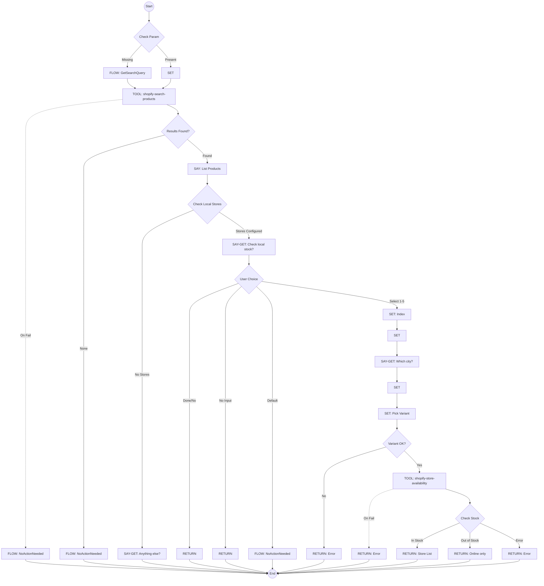
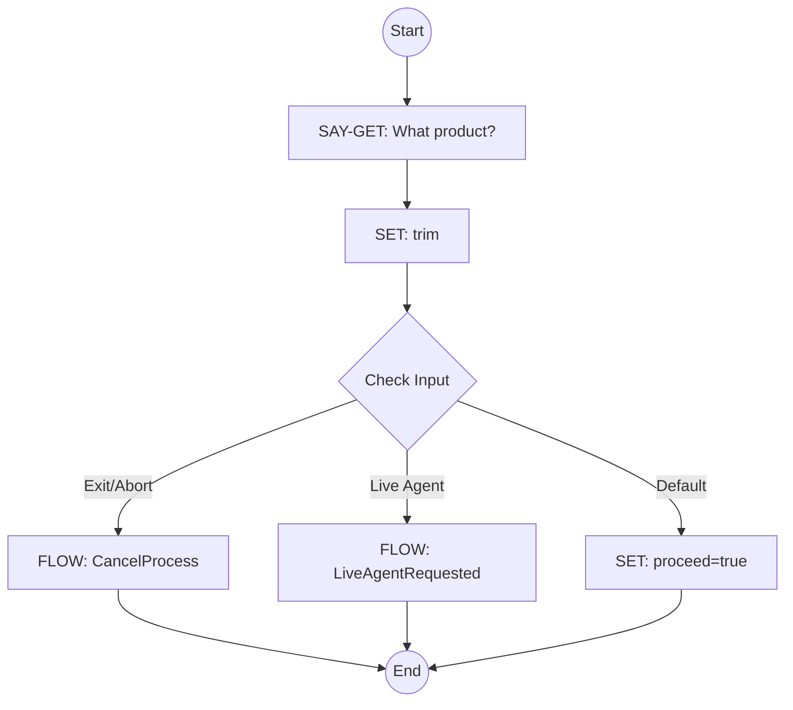
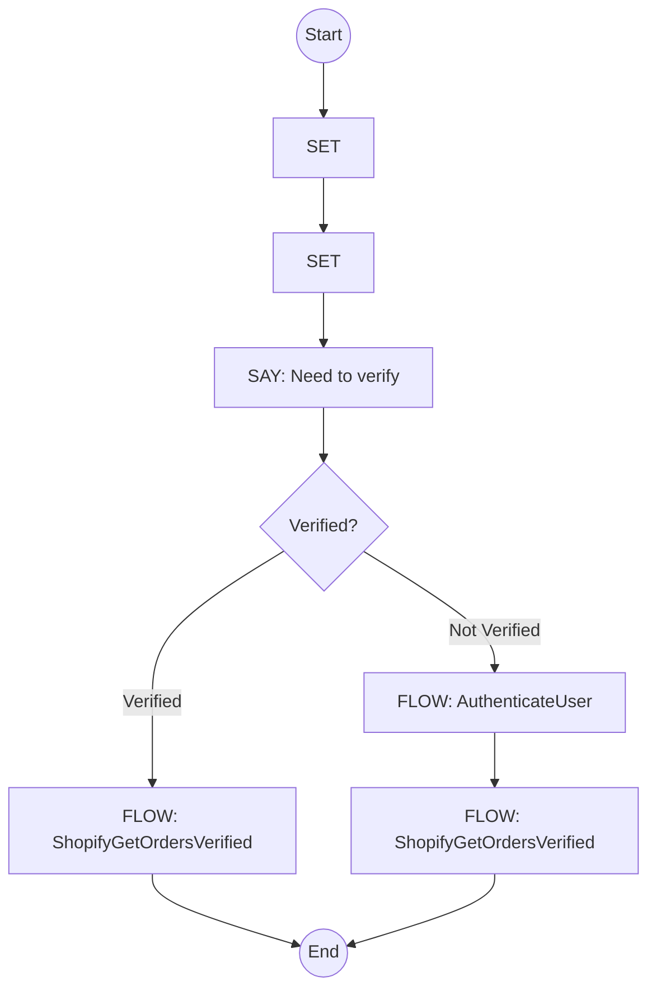
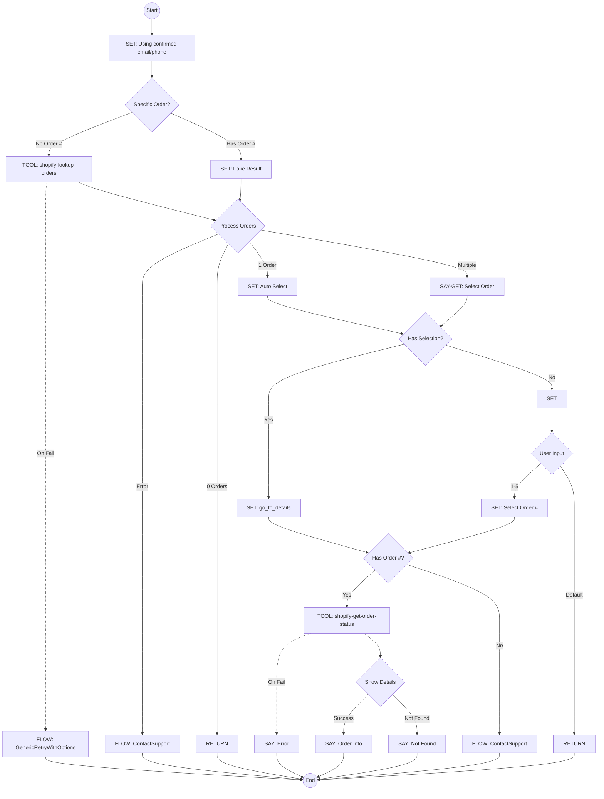
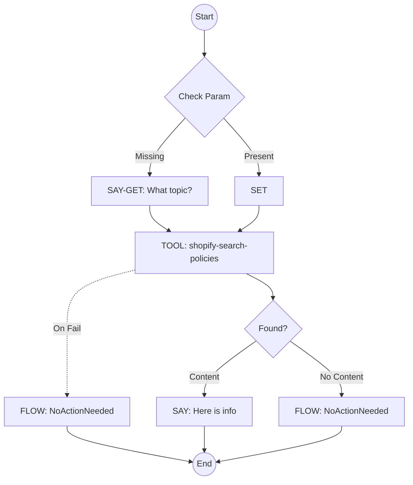

# Shopify Flows Library

This document details the e-commerce flows provided in the `flows/shopify.flows.json` library. These flows provide integration with Shopify for product search, order tracking, and store policy inquiries.

## Table of Contents
- [ShopifyProductSearch](#shopifyproductsearch)
- [GetSearchQuery](#getsearchquery)
- [ShopifyTrackOrder](#shopifytrackorder)
- [ShopifyGetOrdersVerified](#shopifygetordersverified)
- [ShopifyStorePolicies](#shopifystorepolicies)

---

## ShopifyProductSearch
**ID**: `shopify-product-search`  
**Triggers**: "product search", "buscar producto"  
**Description**: Help customers search for products, check stock availability, and find local store availability.

This flow powers natural language product discovery. It captures a user's search intent, queries the Shopify catalog via `shopify-search-products`, and formats the results with pricing and stock status. Uniquely, it extends the digital experience to physical retail by allowing users to check inventory at nearby store locations (`shopify-store-availability`) for a selected product variant.

### Parameters
*   `search_query` (string): The product name, brand, or features to search for.

### Flowchart

---

## GetSearchQuery
**ID**: `get-search-query`  
**Description**: Helper flow to request a search string from the user.

A helper flow that ensures a valid search term is captured. If the user hasn't provided a query yet, it prompts them explicitly ("What are you looking for?"). It handles the input normalization and checks for exit commands before returning the query to the parent flow.

### Flowchart

---

## ShopifyTrackOrder
**ID**: `shopify-track-order`  
**Triggers**: "track order", "rastrear pedido"  
**Description**: Help customers view orders and track status. Enforces authentication via `AuthenticateUser`.

This flow handles post-purchase inquiries. Recognizing that order data is sensitive, it enforces a security check by invoking `AuthenticateUser` before proceeding. Once identity is established, it forwards control to `ShopifyGetOrdersVerified` to display the data.

### Parameters
*   `order_number` (string): Specific order number to track.

### Flowchart

---

## ShopifyGetOrdersVerified
**ID**: `shopify-get-orders-verified`  
**Description**: Secure flow to list orders or get details for a verified user.

The core logic for order retrieval. It uses the `shopify-lookup-orders` tool to fetch recent order history for the verified user. It presents a summary list and allows the user to drill down into specific order details (using `shopify-get-order-status`) to see line items, fulfillment status, and tracking links.

### Flowchart

---

## ShopifyStorePolicies
**ID**: `shopify-store-policies`  
**Triggers**: "store policies", "políticas de la tienda"  
**Description**: Help customers find online store policies and FAQs.

This flow provides access to static store content. It captures a policy topic (e.g., "Returns", "Shipping") and uses the `shopify-search-policies` tool to retrieve relevant text from the store's knowledge base, returning the answer directly to the conversation.

### Parameters
*   `policy_query` (string): The user's question about store policies.

### Flowchart

