# System Flows Library

This document details the standard system flows provided in the `flows/system.flows.json` library. These flows handle common utility tasks such as authentication, error handling, and channel switching.

## Table of Contents
- [AuthenticateUser](#authenticateuser)
- [GetCellOrEmail](#getcelloremail)
- [GetAndValidateOtpCode](#getandvalidateotpcode)
- [ValidateOtpCode](#validateotpcode)
- [SwitchToText](#switchtotext)
- [LiveAgentRequested](#liveagentrequested)
- [ContactSupport](#contactsupport)
- [CancelProcess](#cancelprocess)
- [NoActionNeeded](#noactionneeded)
- [GenericRetryWithOptions](#genericretrywithoptions)
- [RetryAuthenticateGeneric](#retryauthenticategeneric)

---

## AuthenticateUser
**ID**: `authenticate-user`  
**Description**: Generic flow to authenticate user via OTP sent to cell or email.

This flow acts as the primary security gatekeeper. It orchestrates the complete authentication lifecycle by first checking existing verification status. If unverified, it delegates to `GetCellOrEmail` to capture contact details, determines the appropriate delivery channel (SMS vs Email), and dispatches a One-Time Password (OTP). It then hands off to `GetAndValidateOtpCode` for user input verification, setting the `auth_result` variable upon success.

### Parameters
*   `retry_flow` (string): Flow to reboot if user wants to retry (default: authenticate-user)
*   `cancel_flow` (string): Flow to reboot if user cancels (default: cancel-process)

### Variables
*   `cell_or_email` (string): User cell or email
*   `cell_number` (string): Customer cell phone number
*   `email` (string): Customer email address

### Flowchart
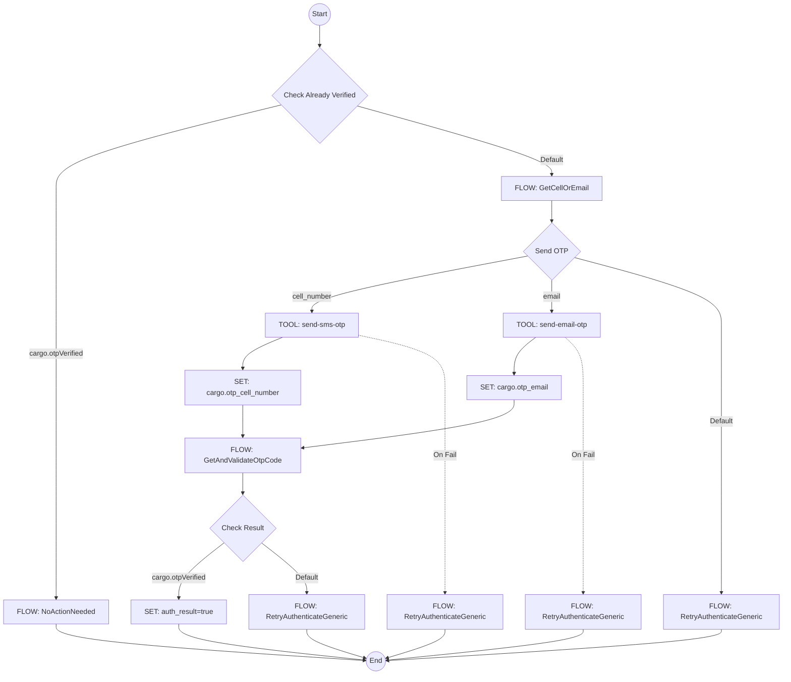

---

## GetCellOrEmail
**ID**: `get-cell-or-email`  
**Description**: Prompt user to provide either their cell phone number or email address for account lookup.

This flow serves as a flexible input collector for contact information. It is designed to handle ambiguity, accepting inputs that could be phone numbers or email addresses. It includes logic to parse and normalize these inputs, stripping formatting characters and validating against regex patterns. It also supports "Caller ID" usage if available from the telephony provider, and handles exit or live agent requests gracefully.

### Parameters
*   `retry_flow` (string): Flow to reboot if user wants to retry
*   `cancel_flow` (string): Flow to reboot if user cancels

### Flowchart
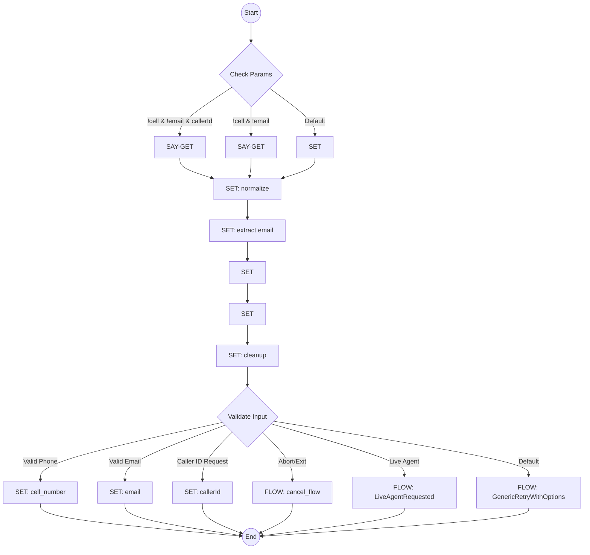

---

## GetAndValidateOtpCode
**ID**: `get-and-validate-otp-code`  
**Description**: Get and validate OTP code from user.

This flow manages the user interaction for entering the verification code. It informs the user where the code was sent (masking the destination for privacy), handles the input prompt, and sanitizes the user's response (removing non-digits). It delegates the actual verification logic to `ValidateOtpCode`.

### Flowchart
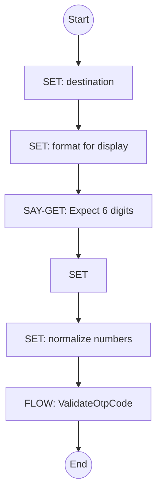

---

## ValidateOtpCode
**ID**: `validate-otp-code`  
**Description**: Validate OTP code entered by user - sets `cargo.otpVerified` on success.

This flow encapsulates the validation logic. It calls the system tool `validate-otp` and evaluates the result. If the code is incorrect, it manages retry attempts or loops back to the input phase. It sets the critical `cargo.otpVerified` flag upon success.

### Flowchart
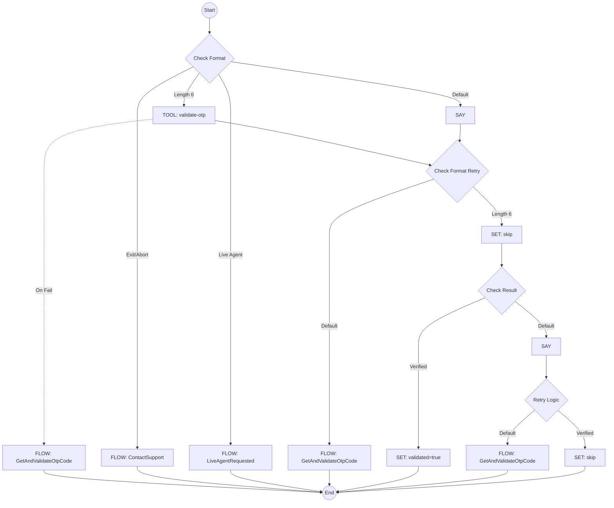

---

## SwitchToText
**ID**: `switch-to-text`  
**Description**: Handles switching the interaction from Voice to SMS. Checks if already text, sends welcome SMS, and confirms.

This flow manages the channel migration from Voice to SMS. It checks if the current session is voice-based. If so, it composes a welcome message (potentially including a WhatsApp link) and uses the `switch-to-sms` tool to send it to the caller's ID. It then confirms the action to the user. Should be called using the "reboot" call type.

### Flowchart
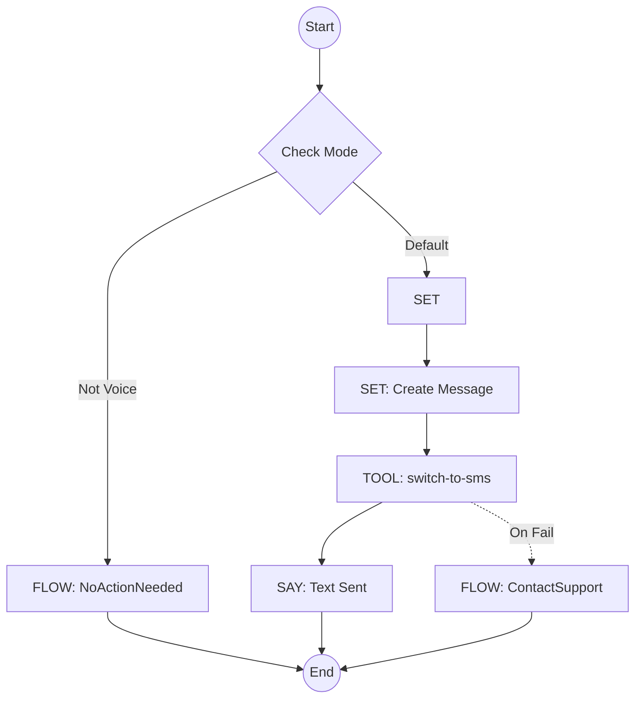

---

## LiveAgentRequested
**ID**: `live-agent-requested`  
**Description**: Interception flow when user requests live agent. Attempts to defect to AI, then transfers if insisted.

This flow implements a deflection strategy. When a user requests a human agent, the AI first attempts to offer immediate assistance for common tasks (deflection). If the user insists (by pressing 0 or confirming), it facilitates the transfer mechanics, or informs the user if no agents are configured. Should be called using the "reboot" call type.

### Flowchart
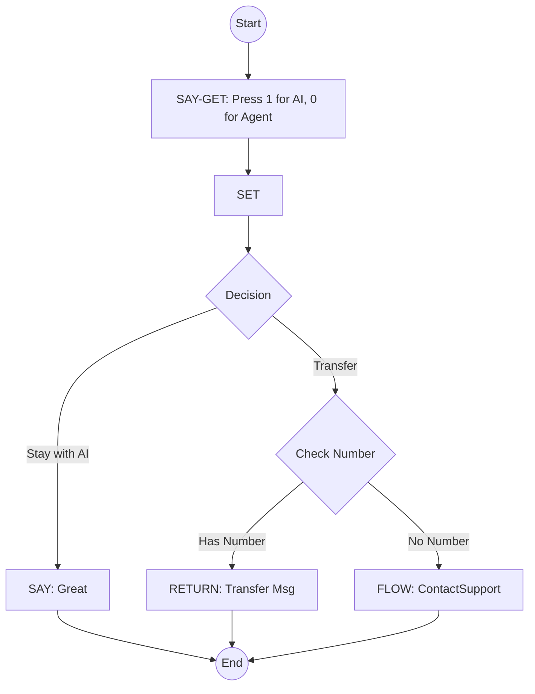

---

## ContactSupport
**ID**: `contact-support`  
**Description**: Provide customer service contact information.

A terminal flow that provides the user with support contact details (phone/email) when the AI cannot resolve the request or an error occurs. It supports English and Spanish localization. Should be called using the "reboot" call type.

### Flowchart
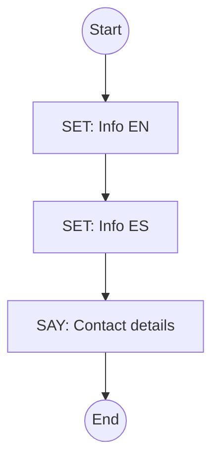

---

## CancelProcess
**ID**: `cancel-process`  
**Description**: Handle flow cancellation by user. Returns a localized cancellation message.

A simple utility flow to acknowledge a user's request to stop the current operation. It returns a localized confirmation message and ends the current flow stack. Should be called using the "reboot" call type.

### Flowchart
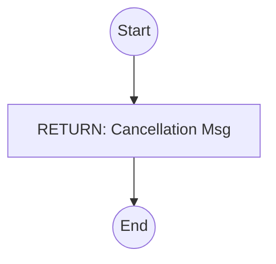

---

## NoActionNeeded
**ID**: `no-action-needed`  
**Description**: Passive flow when no action is required, or to delegate handling back to the host.

A "noop" (no operation) flow used as a logical placeholder in branching scenarios. By returning an empty string (`''`), this flow signals the engine to delegate handling of the user's input back to the host application (usually a Conversational AI). This is particularly useful when a specialized flow (like a product search) is triggered but yields no results; calling `NoActionNeeded` allows the host AI to respond to the original prompt conversationally instead of the flow failing silently or providing a rigid error message. Should be called using the "reboot" call type.

### Flowchart
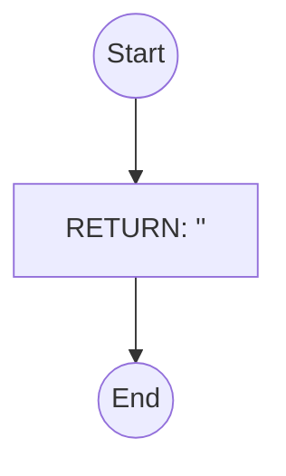

---

## GenericRetryWithOptions
**ID**: `generic-retry-with-options`  
**Description**: Generic flow to offer retry, switch to text, or contact support.

A comprehensive error recovery flow. It standardizes how errors are presented to users, offering explicit options to Retry (loop back), Switch to Text, or Exit. It includes "Smart Capture" capabilities to detect if the user simply answered the original question instead of navigating the menu.

### Flowchart
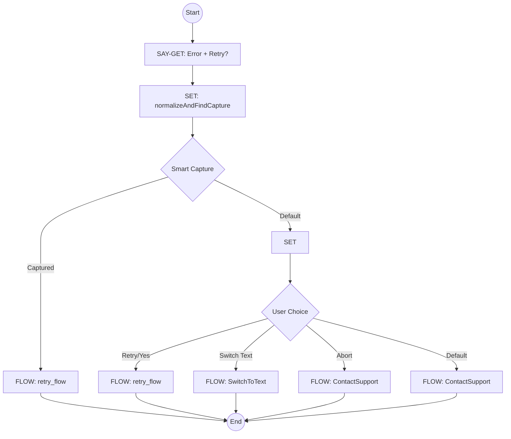

---

## RetryAuthenticateGeneric
**ID**: `retry-authenticate-generic`  
**Description**: Specialized retry loop for authentication failures.

A specialized version of the retry logic tailored for authentication. It allows the user to re-enter their OTP directly if the previous attempt failed, or restart the entire authentication flow (e.g., to correct a typo in their email/phone).

### Flowchart
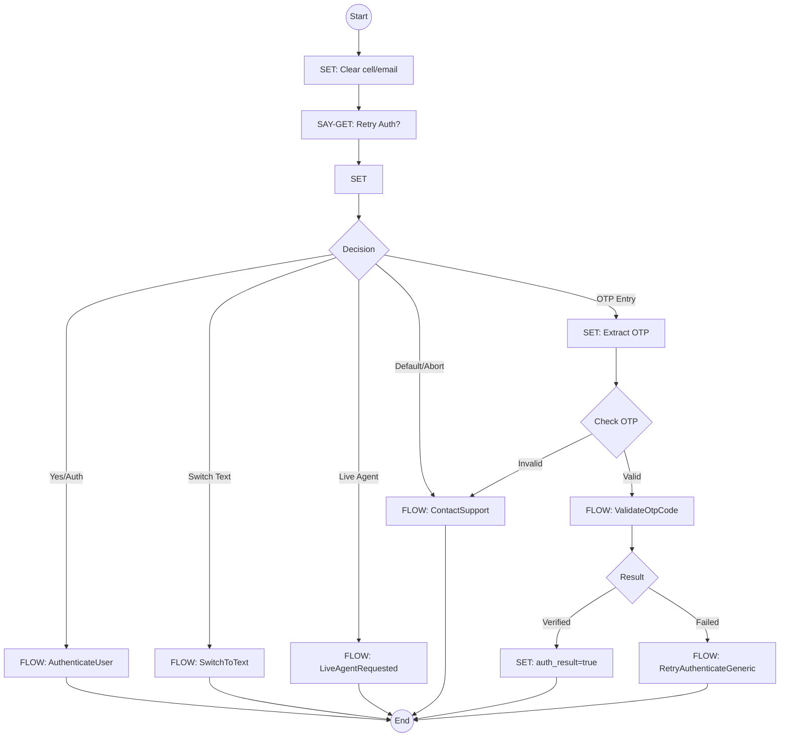
