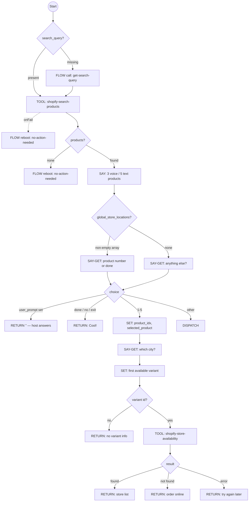
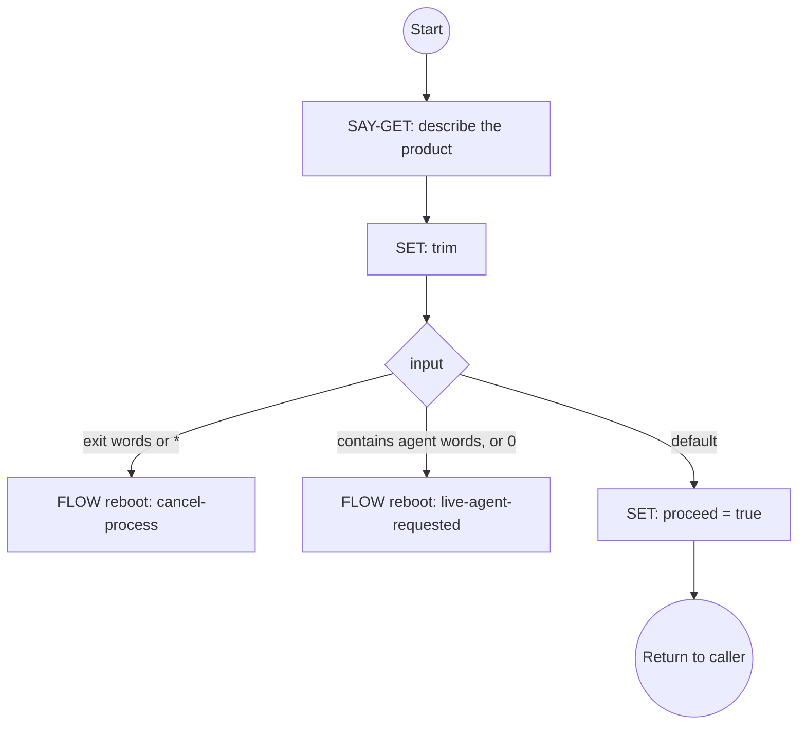
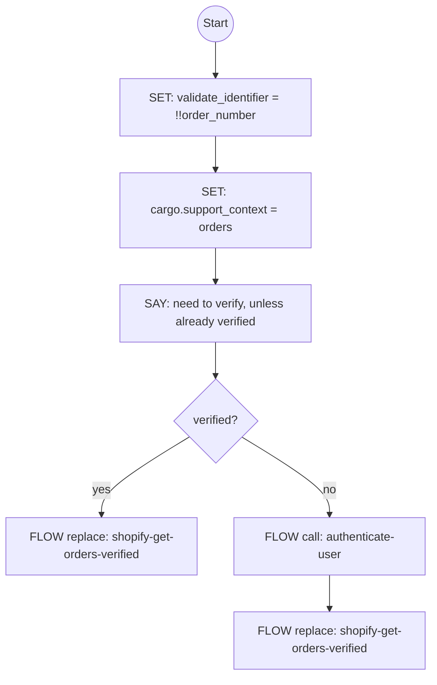
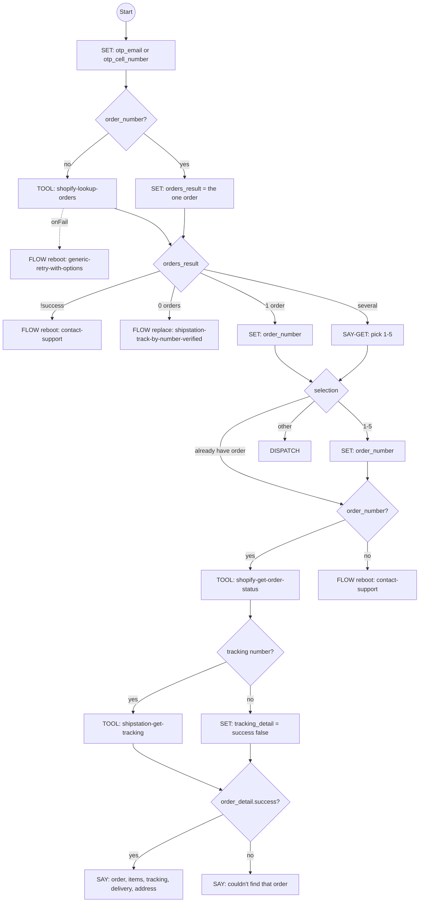
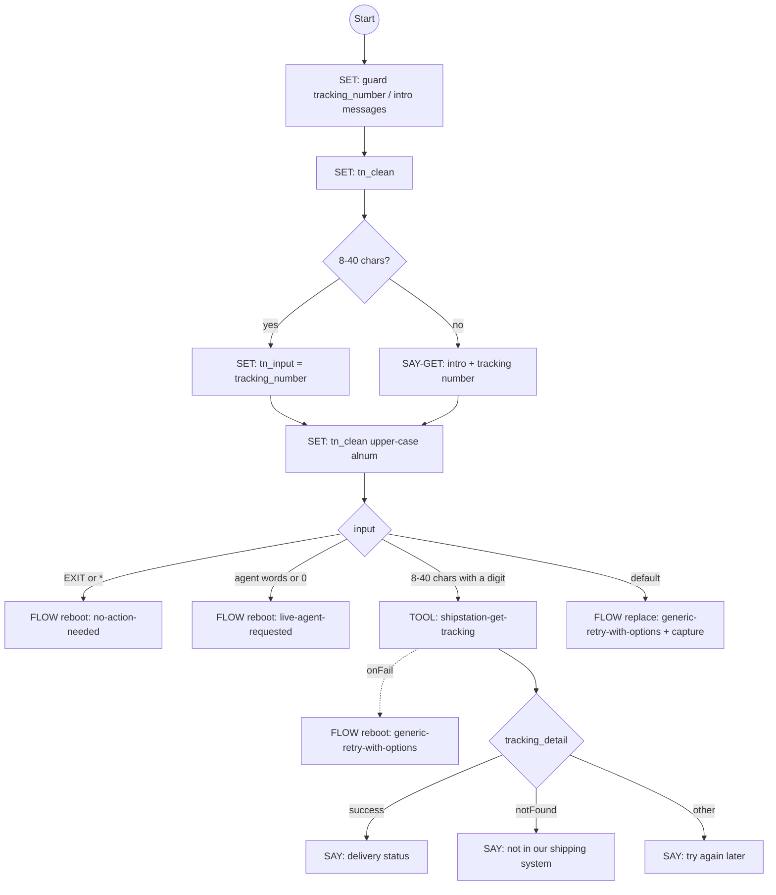
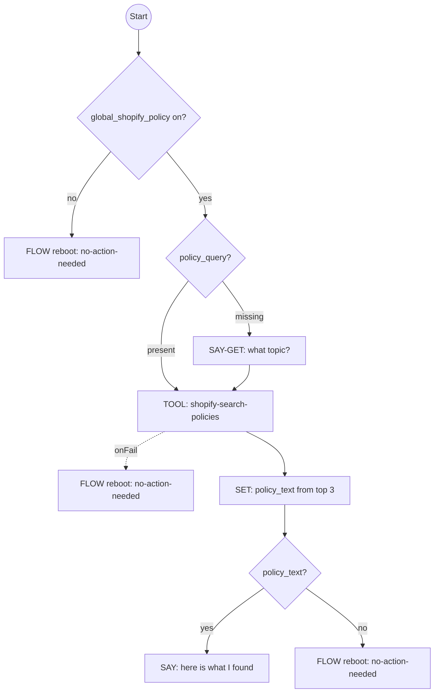

# Shopify Flows Library

This document details the e-commerce flows in `flows/shopify.flows.json` and the tools in `flows/shopify.tools.json`. These flows provide integration with Shopify (and ShipStation for carrier tracking) for product search, local store availability, order tracking and store policy questions.

Everything below is read from the JSON. The flows call the system flows (`no-action-needed`, `cancel-process`, `contact-support`, `live-agent-requested`, `authenticate-user`, `generic-retry-with-options`). Call types, `onFail` behaviour, cargo fields and the host-supplied expression helpers (`matchesChoice`…) work as described in [System Flows → Conventions](system-flows.md#conventions-used-by-these-flows).

## Table of Contents
- [Flows](#flows)
  - [ShopifyProductSearch](#shopifyproductsearch)
  - [GetSearchQuery](#getsearchquery)
  - [ShopifyTrackOrder](#shopifytrackorder)
  - [ShopifyGetOrdersVerified](#shopifygetordersverified)
  - [ShipStationTrackByNumberVerified](#shipstationtrackbynumberverified)
  - [ShopifyStorePolicies](#shopifystorepolicies)
- [Tools](#tools)
  - [shopify-search-products](#shopify-search-products)
  - [shopify-get-product](#shopify-get-product)
  - [shopify-get-cart](#shopify-get-cart)
  - [shopify-add-to-cart](#shopify-add-to-cart)
  - [shopify-apply-discount](#shopify-apply-discount)
  - [shopify-search-policies](#shopify-search-policies)
  - [shopify-lookup-orders](#shopify-lookup-orders)
  - [shopify-get-order-status](#shopify-get-order-status)
  - [shopify-store-availability](#shopify-store-availability)
  - [shipstation-get-tracking](#shipstation-get-tracking)

**Tenant inputs these flows read:** the global variables `global_store_locations` (an array of store records, required for the local-stock offer in ShopifyProductSearch) and `global_shopify_policy` (opt-in for ShopifyStorePolicies). They also read the cargo fields `cargo.voice`, `cargo.verb` / `verb_es`, `cargo.otpVerified`, `cargo.otp_email` and `cargo.otp_cell_number`. `shopify-track-order` writes `cargo.support_context` / `support_context_es`.

---

## Flows

## ShopifyProductSearch
**ID**: `shopify-product-search` · **Version**: 1.0.0 · **Primary** (prompt "product search" / "buscar producto")  
**Description**: Help customers search for products, product availability (also per location), or pricing. It should not trigger on requests for general advice; the prompt must explicitly ask to find a product, its availability (possibly at a location), or its price.

### Parameters
*   `search_query` (string): The product name, brand and/or features the user specified.

### Variables
`search_query` (initial `""`), `search_result`, `product_choice`, `product_idx`, `selected_product`, `selected_variant`, `user_city`, `store_availability`, `user_prompt` (the user's follow-up when no stores are defined; forwarded to the host via an empty return).

### Steps
1. `get-search-query-if-no-param` (CASE) — `!search_query` → FLOW `get-search-query` (`call`).
2. `search_products` (CALL-TOOL [`shopify-search-products`](#shopify-search-products)) — `{query: search_query, context: "Customer searching via chat", limit: 5, language}` into `search_result`. `onFail` → FLOW `no-action-needed` (`reboot`).
3. `display_results` (CASE) — `search_result.products` non-empty → SAY "Great! Here's what I found for '{query}':" followed by up to **3 products on voice, 5 otherwise**. Each shows:
   - its title;
   - its price, from `price_range.min.amount` / `max.amount` divided by 100 (UCP amounts are cents): "$89.99", or a range "$a - $b", or "Price varies";
   - a stock line, from `variants[].availability.available` (or `variants[].available`): "In Stock", "Limited Stock (n/m options available)", "Out of Stock", or nothing when the product has no variants;
   - "View: {url}".

   No products → FLOW `no-action-needed` (`reboot`).
4. `check_global_store_locations` (CASE) — `global_store_locations` is a non-empty array → SAY-GET `product_choice`: "Would you like to check which stores near you have any of these in stock? Tell me the product number (1-5), or say 'done'…". Otherwise → SAY-GET `user_prompt`: "Is there anything else I can help you with today?"
5. `check_product_choice` (CASE, first match wins):
   - `user_prompt` set (the answer to "Anything else?") → **`DISPATCH`** (1.1.0): the answer goes to intent detection — another flow can start at once — else to the host.
   - `done | no | exit | listo | no gracias | salir` (whole answer, case-insensitive) → `RETURN` "Cool! If you need anything else, just ask."
   - `1`–`5` → SET `product_idx` (0-based).
   - anything else → **`DISPATCH`** (1.1.0).
6. `set_selected_product` → `search_result.products[product_idx]`.
7. `ask_city` (SAY-GET `user_city`) — "What city are you near? I'll find stores with this item in stock." Then `normalize_city` trims the answer.
8. `set_selected_variant` — the first variant that is available, else the first variant, else `null`.
9. `check_variant_valid` (CASE) — a variant id (`id` or `variant_id`) → SET `variant_gid`. Otherwise `RETURN` "Sorry, I couldn't get variant information for this product."
10. `lookup_store_availability` (CALL-TOOL [`shopify-store-availability`](#shopify-store-availability)) — `{variantId: variant_gid, city: user_city, storeLocations: global_store_locations, maxStores: 3}` into `store_availability`. `onFail` → `RETURN` "Sorry, I couldn't check store availability at this time."
11. `display_availability` (CASE):
    - `success && found && stores.length > 0` → `RETURN` "{productTitle}[ - {variantTitle}] Available for pickup at:", then per store "{n}. {name} ({city}) / {available} in stock - {distance.toFixed(1)} miles away / {address} / {phone}", then "Need anything else?".
    - `success && !found` → `RETURN` "Sorry, this product is not currently available for in-store pickup at any location. You can order it online for delivery."
    - otherwise → `RETURN` "I couldn't check store availability. Please try again later."

Voice lists 3 products, but the store prompt still offers "1-5", so a caller can pick a product that was not read aloud. On a store-availability failure the step-10 `onFail` RETURN ends the flow with its own message. (Under jsfe ≤ 0.9.88 it ran only after step 11, whose default `RETURN` won, so the caller heard "I couldn't check store availability. Please try again later.")

### Ends
Always by `RETURN` (all flows end), or by a `reboot` into `no-action-needed`, which hands the turn to the host.

### Flowchart

---

## GetSearchQuery
**ID**: `get-search-query` · **Version**: 1.0.0 · **Sub-flow**  
**Description**: Get a search query string from the user for product search.

### Steps
1. `ask_what_looking_for` (SAY-GET `search_query`) — "Please describe the product you are looking for, using natural language. You can also mention brand names or features." Then `normalize_search` trims the answer.
2. `check_for_exit` (CASE):
   - the whole answer, lower-cased, is one of `*`, `abort`, `exit`, `quit`, `salir` → FLOW `cancel-process` (`reboot`).
   - the answer **contains** any of `live, agent, customer service, agente, gente, gerente, al cliente, representante` (substring match, not `matchesChoice`), or is `0` → FLOW `live-agent-requested` (`reboot`).
   - default → SET `proceed = true`.

### Ends
By completion, returning `search_query` to `shopify-product-search` (shared variables), or by one of the reboots.

### Flowchart

---

## ShopifyTrackOrder
**ID**: `shopify-track-order` · **Version**: 1.0.0 · **Primary** (prompt "track order" / "rastrear pedido")  
**Description**: Help customers view their orders and track their order status. Requires OTP verification.

### Parameters
*   `order_number` (string): Order number, if provided in the query.

### Variables
`customer_email`, `order_number` (initial `""`), `order_result`, `cell_number` (initial `""`), `email` (initial `""`), `order_detail`, `validate_identifier`, `error_message`.

### Steps
1. `set_validate_if_from_param` — `validate_identifier = !!order_number`. An order number taken from the user's prompt must be checked against the verified identity.
2. `set_support_context` — `cargo.support_context = 'orders'`, `cargo.support_context_es = 'pedidos'` (read by `contact-support`).
3. `explain_verification` (SAY) — "I can help you track your order. For your security, I'll need to verify your identity first." Empty when already verified (`cargo.otpVerified` and `cargo.otp_email || cargo.otp_cell_number`).
4. `check_otp_status` (CASE):
   - already verified (same test) → FLOW `shopify-get-orders-verified` (`replace`).
   - otherwise → FLOW `authenticate-user` (`call`) with `retry_flow: "shopify-track-order"`, `cancel_flow: "contact-support"`.
5. `proceed_to_orders` — FLOW `shopify-get-orders-verified` (`replace`), reached when `authenticate-user` returns.

The flow does not re-check `cargo.otpVerified` after `authenticate-user` returns. The order tools enforce OTP themselves (they return `success: false` with `requiresOTP: true`). In `shopify-get-orders-verified`, that sends a failed order lookup to `contact-support`, and a failed order-status call to "Sorry, I couldn't find that order".

### Ends
By `replace` into `shopify-get-orders-verified`, or through `authenticate-user`'s exits.

### Flowchart

---

## ShopifyGetOrdersVerified
**ID**: `shopify-get-orders-verified` · **Version**: 1.0.0 · **Sub-flow**  
**Description**: Get order list for verified customer.

Reached by `replace` from `shopify-track-order`, so it keeps that flow's variables (`order_number`, `validate_identifier`).

### Variables
`orders_result`, `order_number`, `user_choice` (initial `""`), `shopify_identifier`, `tracking_detail` (ShipStation real-time tracking result).

### Steps
1. `set_shopify_identifier` — `cargo.otp_email || cargo.otp_cell_number` (the verified contact).
2. `call_tool_if_no_param` (CASE):
   - `!order_number` → CALL-TOOL [`shopify-lookup-orders`](#shopify-lookup-orders) `{identifier: shopify_identifier, container: cargo}` into `orders_result`. `onFail` → FLOW `generic-retry-with-options` (`reboot`): "I had trouble looking up your orders.", `retry_flow: "shopify-get-orders-verified"`, `cancel_flow: "contact-support"`.
   - otherwise → SET `orders_result = {success: true, orders: [{orderNumber: order_number}]}` (skips the lookup).
3. `display_orders` (CASE):
   - `!orders_result || !orders_result.success` → FLOW `contact-support` (`reboot`).
   - no orders → FLOW `shipstation-track-by-number-verified` (`replace`) with `intro_message`: "Sorry, I couldn't find any orders associated with your account. If you have a package tracking number, I can look it up directly." (and Spanish).
   - one order → SET `order_number = orders_result.orders[0].orderNumber`.
   - several → SAY-GET `user_choice`: "Hi {orders_result.customer.firstName}! Here are your recent orders:", then up to 5 lines: "{n}. Order {orderNumber} / Date: {createdAt as locale date} / Status: {overallStatus or 'Processing'} / Total: ${total.amount}". Then "To see details for a specific order, {verb} the order number (e.g., '1' for the first order)…".
4. `check_single_order` — `go_to_details = !!order_number`.
5. `handle_selection` (CASE) — `go_to_details` → continue. `1`–`5` → `order_number = orders_result.orders[n-1]?.orderNumber || ''`. Otherwise → **`DISPATCH`** (1.1.0): the answer goes to intent detection, else to the host.
6. `get_specific_order` (CASE):
   - `order_number` → CALL-TOOL [`shopify-get-order-status`](#shopify-get-order-status) `{orderNumber: order_number, identifier: shopify_identifier, container: cargo, validateIdentifier: validate_identifier}` into `order_detail`. `onFail` → SAY "I couldn't retrieve details for that order. Please try again."
   - otherwise → FLOW `contact-support` (`reboot`).
7. `fetch_shipstation_tracking` (CASE) — when `order_detail.success` and `order_detail.order.fulfillments[0].tracking[0].number` exists → CALL-TOOL [`shipstation-get-tracking`](#shipstation-get-tracking) `{trackingNumber: that number, container: cargo}` into `tracking_detail`. Its `onFail` is SET `tracking_detail = {success: false}`. Without a tracking number → SET `tracking_detail = {success: false}`.
8. `show_order_detail` (CASE):
   - `order_detail.success && order_detail.order` → SAY:
     - "Order {orderNumber}" / "Status: {fulfillmentStatus or 'Processing'}" / "Payment: {financialStatus}" / "Total: ${total.amount}";
     - "Items:" with "- {title} (x{quantity})" per line item;
     - "Tracking: {fulfillments[0].tracking[0].company} - {number}" and "Track: {url}" when present;
     - when `tracking_detail.success`: "Delivery status: {statusDescription}", "Delivery issue: {exception}", "Last update: {lastEvent}", then "Delivered on: {actualDelivery}" or "Estimated delivery: {estimatedDelivery}";
     - "Shipping to:" with the name, `address1`, "city, province zip" from `shippingAddress`, or "N/A";
     - "Anything else I can help with?"

     The Spanish text maps `tracking_detail.status` codes (AC, IT, DE, EX, AT, NY, SP, UN) to Spanish labels and uses `lastEventEs`.
   - otherwise → SAY "Sorry, I couldn't find that order. Anything else I can help with?"

Both onFail handlers in steps 6 and 7 are non-FLOW, so they run immediately after the failed tool and the flow then continues (see Conventions). On a `shopify-get-order-status` failure the user hears the step-6 SAY ("I couldn't retrieve details…") and then step 8's "Sorry, I couldn't find that order…", since `order_detail` still holds the error text. (Under jsfe ≤ 0.9.88 the order was reversed.)

### Ends
By completion after the order detail (the SAYs carry `variable: continue_choice`, which is not read). Otherwise by `reboot` into `contact-support` / `no-action-needed` / `generic-retry-with-options`, or `replace` into `shipstation-track-by-number-verified`.

### Flowchart

---

## ShipStationTrackByNumberVerified
**ID**: `shipstation-track-by-number-verified` · **Version**: 1.0.0 · **Sub-flow**  
**Description**: Collect a tracking number and read back real-time ShipStation tracking for verified customer.

Reached by `replace` from `shopify-get-orders-verified` when the verified customer has no Shopify orders. It retries into itself via `generic-retry-with-options`.

### Variables
`tracking_number` (initial `""`; also the smart-capture target), `tn_input`, `tn_clean`, `intro_message` / `intro_message_es` (optional text spoken before the question), `tracking_detail`.

### Steps
1. Guards — `tracking_number` (as a string), `intro_message` and `intro_message_es` default to `''` when undefined.
2. `clean_param` — `tn_clean` = `tracking_number` with non-alphanumerics removed.
3. `ask_if_missing` (CASE) — `tn_clean` is 8–40 characters → `tn_input = tracking_number` (no prompt). Otherwise → SAY-GET `tn_input` (`digits: {min 8, max 34}`): "[{intro_message} ]Please {verb} [or enter] your tracking number[, followed by the pound key if entered using the dial pad]. To exit anytime … EXIT."
4. `normalize_input` — `tn_clean` = `tn_input`, alphanumerics only, upper-cased.
5. `route_input` (CASE):
   - EXIT words in at most two words, or `*` → FLOW `no-action-needed` (`reboot`).
   - live-agent words or `0` → FLOW `live-agent-requested` (`reboot`).
   - `tn_clean` is 8–40 characters and contains a digit → CALL-TOOL [`shipstation-get-tracking`](#shipstation-get-tracking) `{trackingNumber: tn_clean, container: cargo}` into `tracking_detail`. `onFail` → FLOW `generic-retry-with-options` (`reboot`): "I had trouble looking up that tracking number.", `retry_flow: "shipstation-track-by-number-verified"`, `cancel_flow: "contact-support"`.
   - default → FLOW `generic-retry-with-options` (`replace`): "That doesn't look like a valid tracking number. Tracking numbers are at least 8 letters and digits.", same retry/cancel flows, `capture_patterns: [{variable: "tracking_number", regex: "[A-Za-z0-9]{8,40}"}]`.
6. `show_result` (CASE):
   - `tracking_detail.success` → SAY "Here's the latest on tracking number {number}:", then the delivery status, issue, last update and delivered / estimated date (same rendering as ShopifyGetOrdersVerified), then "Anything else I can help with?". On voice the number is read as "ending in 1, 2, 3, 4" (its last four characters).
   - `tracking_detail.notFound` → SAY "I couldn't find tracking number {number} in our shipping system. Please double-check the number. Anything else I can help with?"
   - otherwise → SAY "I wasn't able to retrieve tracking information right now. Please try again later. Anything else I can help with?"

### Ends
By completion after the result SAY, or by a `reboot` / `replace` into another flow.

### Flowchart

---

## ShopifyStorePolicies
**ID**: `shopify-store-policies` · **Version**: 1.1.0 · **Primary** (prompt "store policies" / "políticas de la tienda")  
**Description**: Help customers find online store policies and FAQs.

### Parameters
*   `policy_query` (string): The user's question about store policies.

### Variables
`policy_query` (initial `""`), `policy_result` (array of `{question, answer}`, the tool's `returns`), `policy_text` (the formatted answers; empty when none).

### Tenant opt-in: `global_shopify_policy`
The flow answers from Shopify **only when the tenant global variable `global_shopify_policy` is on**. It is on when all of these hold:
- it is defined;
- it is truthy;
- `String(global_shopify_policy).trim().toLowerCase()` is not `"false"`, `"0"` or `""`.

So `true`, `"true"`, `"yes"` or `1` turn it on, while an absent variable, `false`, `0`, `"false"`, `"FALSE"`, `" 0 "` or `""` leave it off. When it is off, the first step reboots into `no-action-needed`, which hands the question to the host (e.g. its RAG pipeline).

### Steps
1. `check_shopify_policy_optin` (CASE) — not opted in → FLOW `no-action-needed` (`reboot`). Otherwise continue.
2. `check_policy_param` (CASE) — `!policy_query` → SAY-GET `policy_query`: "I can help you find information about our store policies. What would you like to know about? For example: return policy, shipping, refunds, or exchanges."
3. `search_policies` (CALL-TOOL [`shopify-search-policies`](#shopify-search-policies)) — `{query: policy_query, context: "Customer asking about store policies via chat"}` into `policy_result`. `onFail` → FLOW `no-action-needed` (`reboot`).
4. `format_policy_answers` — when `policy_result` is a non-empty array, it takes the first 3 matches. On voice, their `answer`s are joined with spaces. On text, each becomes a line "• {question} — {answer}". Anything else (e.g. an error string) → `''`.
5. `display_policy` (CASE) — `policy_text` → SAY "Here's what I found for '{policy_query}': {policy_text} Is there anything else you'd like to know?". Empty → FLOW `no-action-needed` (`reboot`).

### Ends
By completion after the answer, or by a `reboot` into `no-action-needed` (host answers) when not opted in, on failure, or when nothing matched.

### Flowchart

---

## Tools

All ten are `local` tools; the host supplies each `implementation.function` through `APPROVED_FUNCTIONS`. Their `parameters` are in the flat form, so the engine passes **positional arguments: the `required` names in order, then the remaining properties in definition order**. The engine does not read `implementation.args`. Where the engine's order differs from the `implementation.args` list, the entry says so.

Each tool declares `returns`, a JSON Schema of the value the CALL-TOOL `variable` receives. It is documentation, plus an optional warning when the host sets `engine.validateToolReturns = true`. The summaries below paraphrase it. Money differs by API: UCP catalog amounts are **integer cents**, while Admin API order totals are **decimal strings in major units** (`"129.99"`).

`security.requiresAuth` / `authType: "otp"` are declarative; the order and tracking functions check the OTP status in `container` themselves (see their `requiresOTP` failure). The engine enforces `security.rateLimit`.

### shopify-search-products
**Search Shopify Products** — search the store catalog with a natural-language query.  
**Implementation**: `searchShopifyProducts(query, context, limit, language)`, timeout 10000 ms, 30 per 60 s.

| Parameter | Type | Required | Default / notes |
|---|---|---|---|
| `query` | string | yes | e.g. "65 inch TV" |
| `context` | string | no | "Customer browsing" |
| `limit` | integer | no | 5 |
| `language` | string | no | BCP 47 tag, falls back to `en` |

**Returns** the Shopify UCP `search_catalog` response, passed through unchanged: `{ ucp, products[], pagination{has_next_page, cursor}, messages }`. Each product has:
- `id` (`gid://shopify/Product/<n>`), `title`, `url` (`…/products/<handle>`), `handle`, `description{html}`;
- `price_range.min` / `price_range.max` as `{amount: cents, currency}`, and `list_price_range` (compare-at, same shape);
- `variants[]`: `{id (ProductVariant GID), sku, title, price{amount, currency}, availability{available}, checkout_url}`;
- `options`, `media`.

Paths the flow reads: `products[].title`, `.url`, `.price_range.min/max.amount`, `.variants[].availability.available`, `.variants[].id`.

Failure shapes: a **string** when the MCP text was not JSON (e.g. an upstream error with `isError: true`); any other JSON value; or the raw JSON-RPC result `{content[], isError}` when it had no text item.

### shopify-get-product
**Get Product Details** — one product with variants, pricing and availability. Not used by the flows in this library.  
**Implementation**: `getShopifyProductDetails(productId, variantOptions)`, timeout 5000 ms, 30 per 60 s.

| Parameter | Type | Required | Default / notes |
|---|---|---|---|
| `productId` | string | yes | Shopify product ID |
| `variantOptions` | object | no | `null`; variant options to select |

**Returns** the UCP `get_product` response unchanged: `{ ucp, product, messages }`. `product` has the same shape as a search result product, plus `selected`. Failure shapes as for search.

### shopify-get-cart
**Get Shopping Cart** — current cart contents, totals and checkout URL. Not used by the flows in this library.  
**Implementation**: `getShopifyCart(cartId)`, timeout 5000 ms, 30 per 60 s. Parameter: `cartId` (string, required).

**Returns** the Shopify MCP cart response unchanged. The object is upstream-defined; the code neither builds nor reads it. Failure shapes as for search.

### shopify-add-to-cart
**Add to Cart** — add items to the cart, creating one when `cartId` is not provided. Not used by the flows in this library.  
**Implementation**: `addToShopifyCart`, timeout 10000 ms, 20 per 60 s.

| Parameter | Type | Required | Default / notes |
|---|---|---|---|
| `cartId` | string | no | `""`; existing cart ID |
| `items` | array | yes | `[{variantId, quantity}]` |

**Argument order:** `implementation.args` lists `(cartId, items)`, but by the engine's rule (required first) the function is called as **`addToShopifyCart(items, cartId)`**.

**Returns** the MCP cart response unchanged (as for get-cart).

### shopify-apply-discount
**Apply Discount Code** — apply a discount or promo code to the cart. Not used by the flows in this library.  
**Implementation**: `applyShopifyDiscount(cartId, discountCode)`, timeout 5000 ms, 10 per 60 s. Parameters: `cartId`, `discountCode` (strings, both required).

**Returns** the MCP cart response unchanged (as for get-cart).

### shopify-search-policies
**Search Store Policies** — store policies, FAQs, returns, shipping and contact details.  
**Implementation**: `searchShopifyPolicies(query, context)`, timeout 5000 ms, 20 per 60 s.

| Parameter | Type | Required | Default / notes |
|---|---|---|---|
| `query` | string | yes | the question |
| `context` | string | no | `""` |

**Returns** the upstream `search_shop_policies_and_faqs` response unchanged. Live, it is a JSON **array of `{question, answer}`**, which ShopifyStorePolicies reads as `policy_result[i].question` / `.answer`. Other possible shapes: an object (not observed), including the raw result `{content[], isError}`; a string (MCP text that was not JSON, e.g. an upstream error); or another JSON scalar.

### shopify-lookup-orders
**Lookup Customer Orders** — order history for a verified customer, by phone or email. Requires OTP verification first.  
**Implementation**: `lookupCustomerOrders(identifier, container)`, timeout 15000 ms, 10 per 60 s.

| Parameter | Type | Required | Notes |
|---|---|---|---|
| `identifier` | string | yes | the verified phone or email |
| `container` | object | yes | session cargo; OTP status is read from it |

**Returns** `{ success, … }` on every path.
- **Success**: `success: true`, `customer{firstName, lastName, email, phone}` (each may be null) and `orders[]`, up to 10, newest first. Each order has:
  - `orderNumber` (`Order.name`, e.g. `#1001`), `orderId` (GID), `createdAt` (ISO);
  - `financialStatus` (e.g. `PAID`, nullable);
  - `overallStatus`: the fulfillment status or `CANCELLED[:reason]`, followed by the financial status, e.g. `FULFILLED PAID`;
  - `total{amount (decimal string), currencyCode}`;
  - `tracking[]{number, url}` (the first fulfillment only);
  - `shippingAddress{address1, city, province, zip}`.

  A customer with no orders returns `orders: []` together with `customer`.
- **No matching customer**: `success: true`, `orders: []`, `message: "No orders found for this email"` (or "…phone"), and no `customer`.
- **Failure**: `success: false` and `error`, for example "Shopify Admin API is not configured", "Session container is invalid", "OTP verification required before order lookup", a GraphQL message or "Failed to lookup orders". The OTP / container failures also carry `requiresOTP: true`.

Paths ShopifyGetOrdersVerified reads: `success`, `orders.length`, `orders[i].orderNumber`, `.createdAt`, `.overallStatus`, `.total.amount`, `customer.firstName`.

### shopify-get-order-status
**Get Order Status** — detailed status of one order, including tracking. Requires OTP verification first.  
**Implementation**: `getShopifyOrderStatus`, timeout 15000 ms, 10 per 60 s.

| Parameter | Type | Required | Notes |
|---|---|---|---|
| `orderNumber` | string | yes | `#1001` or `1001` |
| `identifier` | string | yes | the verified phone or email |
| `container` | object | yes | session cargo; OTP status |
| `validateIdentifier` | boolean | no | whether to check the order's email/phone against `identifier` |

**Argument order:** `implementation.args` lists only `(orderNumber, identifier, container)`. The engine passes all declared properties: **`getShopifyOrderStatus(orderNumber, identifier, container, validateIdentifier)`**.

**Returns** `{ success, … }` on every path.
- **Success**: `success: true` and `order`:
  - `orderNumber`, `createdAt`, `financialStatus` (nullable);
  - `fulfillmentStatus` (e.g. `UNFULFILLED` / `FULFILLED`; not cancellation-aware) and `cancelled` (boolean);
  - `total{amount (decimal string), currencyCode}`;
  - `items[]{title, quantity}`;
  - `fulfillments[]{status, tracking[]{number, url, company}, estimatedDelivery}`;
  - `shippingAddress{firstName, lastName, address1, city, province, zip}` (nullable).
- **Failure**: `success: false` and `error`: "Shopify Admin API is not configured", "OTP verification required" (with `requiresOTP: true`), "Order not found. Please verify the order number.", "Order email does not match the provided email.", "Order phone number does not match the provided phone number.", a GraphQL message, or "Failed to fetch order status".

Paths ShopifyGetOrdersVerified reads: `order_detail.success`, `order_detail.order.orderNumber`, `.fulfillmentStatus`, `.financialStatus`, `.total.amount`, `.items[].title` / `.quantity`, `.fulfillments[0].tracking[0].number` / `.company` / `.url`, `.shippingAddress.*`.

### shopify-store-availability
**Find Nearest Stores With Stock** — the nearest stores that have a variant in stock.  
**Implementation**: `findNearestStoresWithStock(variantId, city, storeLocations, maxStores)`, timeout 10000 ms, 20 per 60 s.

| Parameter | Type | Required | Default / notes |
|---|---|---|---|
| `variantId` | string | yes | e.g. `gid://shopify/ProductVariant/12345` |
| `city` | string | yes | the customer's city (geocoded) |
| `storeLocations` | array | yes | the tenant's store records with coordinates (the flow passes `global_store_locations`) |
| `maxStores` | number | no | 3 |

**Returns** `{ success, … }`.
- **In stock somewhere**: `success: true`, `found: true`, `productTitle`, `variantTitle`, `stores[]` and `totalStoresWithStock` (the count before the `maxStores` cut). `stores[]` holds 1..`maxStores` entries sorted by distance; each is `{name, city, address, state, phone, available (quantity > 0), distance (miles)}`, where name/city/address/state/phone come from the tenant's `storeLocations` entry.
- **Nowhere**: `success: true`, `found: false`, `message: "This product is currently not available for in-store pickup at any location."`.
- **Failure**: `success: false` and `error`, e.g. "Product variant not found", "Could not geocode city: <city> after 2 retries", or an inventory/GraphQL message.

### shipstation-get-tracking
**Get ShipStation Tracking** — real-time carrier status and events for a tracking number, via ShipStation. Requires OTP verification first.  
**Implementation**: `getShipStationTracking(trackingNumber, container)`, timeout 15000 ms, 10 per 60 s.

| Parameter | Type | Required | Notes |
|---|---|---|---|
| `trackingNumber` | string | yes | the carrier tracking number |
| `container` | object | yes | session cargo; OTP status |

**Returns** `{ success, … }`.
- **Success**: `success: true` and:
  - `trackingNumber`;
  - `status` (ShipStation code `AC`, `IT`, `DE`, `EX`, `AT`, `NY`, `SP`, `UN`; default `UN`), `statusDescription` (default "Unknown") and `delivered` (`status` is `DE` or `SP`);
  - `exception`, `shippedDate`, `estimatedDelivery`, `actualDelivery` (each may be null);
  - `lastEvent` / `lastEventEs`: the newest event rendered "description - City, ST - date" in en-US / es-US, or `''` when there are no events;
  - `events[]`: at most 5, newest first, each `{occurredAt, description, city, state, eventCode}`.
- **Not a ShipStation label**: `success: false`, `notFound: true`, error "Shipment not found in ShipStation". Expected for labels not bought through ShipStation.
- **Other failures**: `success: false` and `error`: "OTP verification required" (with `requiresOTP: true`), "ShipStation is not configured", "No tracking number provided", "ShipStation label lookup failed (<status>)", "ShipStation tracking request failed (<status>)", or "Failed to fetch ShipStation tracking".

Paths the flows read: `success`, `notFound`, `status`, `statusDescription`, `exception`, `lastEvent`, `lastEventEs`, `actualDelivery`, `estimatedDelivery`.
