# System Flows Library

This document details the standard system flows in `flows/system.flows.json` and the tools they call in `flows/system.tools.json`. These flows handle common utility tasks such as authentication, error recovery, live-agent requests and channel switching.

Everything below is read from the JSON. Where a flow's `description` text and its steps disagree, the steps are what runs, and the difference is called out.

## Table of Contents
- [Conventions Used by These Flows](#conventions-used-by-these-flows)
- [Flows](#flows)
  - [NoActionNeeded](#noactionneeded)
  - [CancelProcess](#cancelprocess)
  - [ContactSupport](#contactsupport)
  - [SwitchToText](#switchtotext)
  - [AuthenticateUser](#authenticateuser)
  - [GetCellOrEmail](#getcelloremail)
  - [GetAndValidateOtpCode](#getandvalidateotpcode)
  - [ValidateOtpCode](#validateotpcode)
  - [GenericRetryWithOptions](#genericretrywithoptions)
  - [RetryAuthenticateGeneric](#retryauthenticategeneric)
  - [LiveAgentRequested](#liveagentrequested)
- [Tools](#tools)
  - [send-sms-otp](#send-sms-otp)
  - [send-email-otp](#send-email-otp)
  - [send-whatsapp-invite](#send-whatsapp-invite)
  - [validate-otp](#validate-otp)
  - [switch-to-sms](#switch-to-sms)
  - [send-twilio-sms](#send-twilio-sms)

---

## Conventions Used by These Flows

**Primary vs. sub-flow.** Only `switch-to-text` is `primary: true`, so it is the only system flow intent detection can start. `live-agent-requested` is explicitly `primary: false`; the others omit `primary`. All of them except `switch-to-text` are reached from a `FLOW` step or an `onFail`.

**Call types** (as used here):
- `call` — run the sub-flow, then resume the caller. The sub-flow works on the caller's variables (the same object), so what it sets (`cell_number`, `email`, `contact_valid`, `auth_result`…) is visible to the caller. Any `value` the sub-flow's `variables` block declares is written into that shared object when it starts.
- `replace` — the current frame becomes the target: its remaining steps are dropped, and its variables are kept with the FLOW step's `parameters` merged in. The target's declared variable defaults are **not** applied.
- `reboot` — clear every active flow and start the target as the only flow, with fresh variables (the global variables, the target's declared defaults, then the `parameters`). SAY output accumulated before the reboot is kept and delivered with the target's output.

**Ending a flow.**
- `RETURN` terminates **all** flows and makes its value the response. `RETURN ''` (used by `no-action-needed` and by `get-cell-or-email`'s off-topic branch) produces an empty response, so the host handles the user's message itself.
- `END` returns from the current flow only, resuming its caller.
- `DISPATCH` terminates **all** flows (queued SAYs included) and routes the turn's input through intent detection; with no match the response is empty and the host answers. No system flow uses it yet.
- A terminal step may declare `outcome` / `reason`. Two system steps declare `outcome: "unresolved"`: `contact-support`'s SAY (`contact_support_fallback`) and `get-cell-or-email`'s off-topic RETURN (`auth_prompt_off_topic`). The engine fails that flow's transaction and reports it once in `sessionContext.lastFlowOutcome`.

**`onFail` on a CALL-TOOL.** A `FLOW` `onFail` runs with its `callType` (default `replace`): `replace` / `reboot` leave the failed flow, `call` runs the handler and then resumes the failed flow at its next step. A non-FLOW `onFail` (SAY / SET / RETURN) runs **immediately** after the failed tool step; a SAY or SET then lets the flow continue with its remaining steps, a RETURN ends it. Before the onFail runs, the CALL-TOOL `variable` holds the error text (a truthy string with no `.success`), so a SET `onFail` that writes a `{ success: false }`-style value is the safest pattern, and a SAY `onFail` is followed by the flow's remaining steps, which may contradict it. (jsfe ≤ 0.9.88 ran a non-FLOW onFail only after the remaining steps, and never ran a FLOW `call` onFail; fixed in 0.9.89.)

**Cargo the flows read or write** (`sessionContext.cargo`, set by the host unless noted):

| Field | Used by | Meaning |
|---|---|---|
| `cargo.voice` | most flows | truthy on a voice call. Adds keypad wording ("press 1", "the asterisk key") to prompts, and turns on the engine's AI voice-input cleanup for SAY-GET answers |
| `cargo.verb` / `cargo.verb_es` | most prompts | the verb inserted into prompts ("Please {{cargo.verb}} …") |
| `cargo.callerId` | get-cell-or-email, switch-to-text | the caller's number, offered as the contact |
| `cargo.twilioNumber` | authenticate-user, switch-to-text, validate-otp-code | the `from` number for SMS |
| `cargo.agentPhoneNumber` | live-agent-requested | a transfer number; its absence means no agents are available |
| `cargo.contact_info` | contact-support | the support contact text (one value for both languages) |
| `cargo.support_context` / `_es` | contact-support | topic phrase, e.g. set to `orders` / `pedidos` by `shopify-track-order` |
| `cargo.otpVerified` | authenticate-user, validate-otp-code, retry-authenticate-generic | written by the `validate-otp` tool on success |
| `cargo.otp_cell_number` / `cargo.otp_email` | written by authenticate-user; read by get-and-validate-otp-code, validate-otp-code | where the OTP was sent |

**Global variables** (tenant-level, optional): `global_whatsapp_invite` / `global_whatsapp_invite_es` (validate-otp-code; empty or absent = the WhatsApp invite is off), `global_live_agents_comment` / `global_live_agents_comment_es` (live-agent-requested).

**Host functions called in expressions.** The flows call `matchesChoice`, `validatePhone`, `validateEmail`, `normalizeAndFindCapture` and `textWithUrlToSpeech` inside conditions and SET values. The engine does not provide them: the host must register them in `APPROVED_FUNCTIONS`. `demos/make-payment.js` has reference implementations (its `matchesChoice` is exact word / word-sequence membership, not substring matching).

**`digits`** on a SAY-GET (`{ min, max, autoSubmitChars?, autoSubmitMs? }`) is copied by the engine to `cargo.digits` while the answer is awaited, for the host's keypad handling (e.g. Twilio ConversationRelay). The engine removes it once the input is collected.

---

## Flows

## NoActionNeeded
**ID**: `no-action-needed` · **Version**: 1.0.0 · **Sub-flow**  
**Description**: Handle case where no action is needed like when user is already authenticated.

A single `RETURN ''`. Returning an empty string terminates all flows and leaves the response empty, so the host answers the user's original message itself (usually with its conversational AI). Other flows use it as a clean hand-off, for example `shopify-product-search` when a search fails or returns nothing, and `shopify-store-policies` when the tenant has not opted in. Callers invoke it with `callType: "reboot"`. (The "already verified" and "already in text mode" branches of the system flows use `END` instead.)

### Flowchart
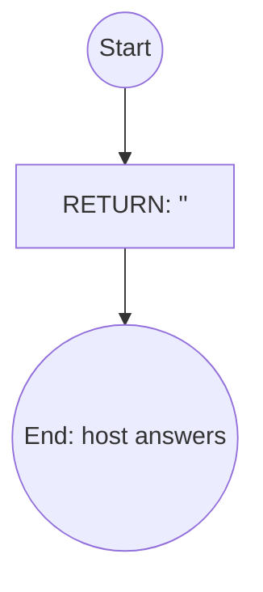

---

## CancelProcess
**ID**: `cancel-process` · **Version**: 1.0.0 · **Sub-flow**  
**Description**: Handle flow cancellation by user.

A single `RETURN` of a localized message: "The process has been cancelled. Anything else I can help with?" (Spanish when `language == 'es'`). Terminates all flows. Used with `callType: "reboot"`, e.g. by `get-search-query` on EXIT.

### Flowchart
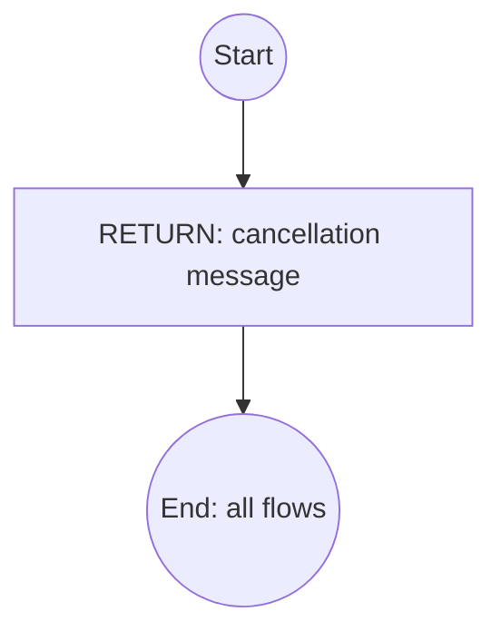

---

## ContactSupport
**ID**: `contact-support` · **Version**: 1.1.0 · **Sub-flow**  
**Description**: Provide customer service contact information. Optional `closing_prompt` / `closing_prompt_es` parameters are spoken after the contact info.

### Parameters
*   `closing_prompt` (string): Optional English sentence spoken after the contact info, e.g. a follow-up question.
*   `closing_prompt_es` (string): Optional Spanish sentence spoken after the contact info.

### Steps
1. `set_contact_info` / `set_contact_info_es` — `contact_info` = `cargo.contact_info`, or "please contact Customer Support" / "por favor contacte a Servicio al Cliente" when unset. On voice (`cargo.voice`) it is passed through `textWithUrlToSpeech(…, language)` so URLs are spoken.
2. `say_support_message` (SAY) — "Sorry I couldn't help! [For assistance with your {cargo.support_context}, ]{contact_info}.[ {closing_prompt}]". The Spanish text uses `cargo.support_context_es` when set, falling back to `support_context`.

### Ends
By completion. The SAY declares **`outcome: "unresolved"`, `reason: "contact_support_fallback"`**, so every path into ContactSupport fails the transaction and sets `sessionContext.lastFlowOutcome`. Every caller in the library uses `callType: "reboot"`.

### Flowchart
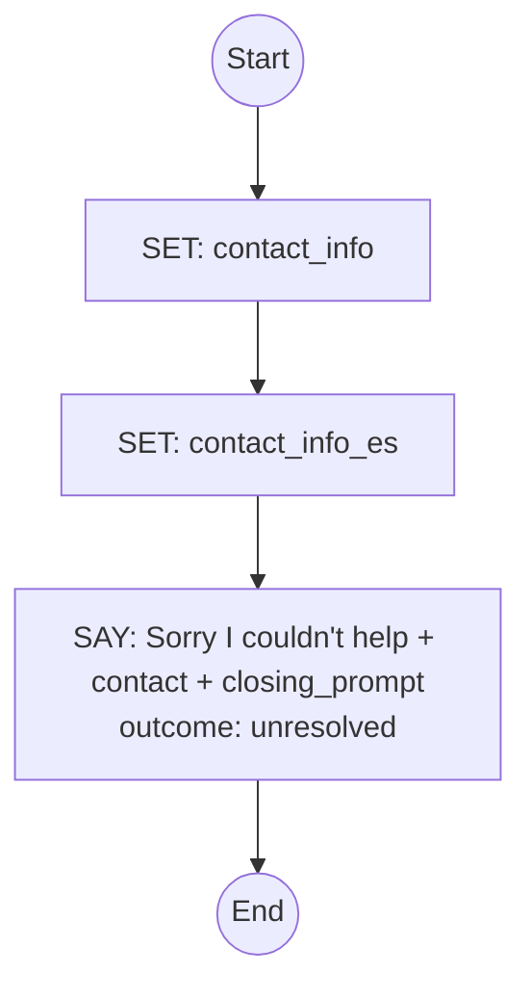

---

## SwitchToText
**ID**: `switch-to-text` · **Version**: 1.0.0 · **Primary** (prompt "Switch to text" / "Cambiar a texto")  
**Description**: Used when the user explicitly asks to switch the chat to text/SMS. It must never be used when the user asks for a live agent, human or manager. It forwards the chat context to SMS and sends a welcome message.

### Variables
*   `sms_result` (object): result of the SMS send.

### Steps
1. `check_already_text` (CASE) — not on voice (`!cargo.voice`) → **END** (nothing to switch). Otherwise continue.
2. `set_welcome_message` (SET) — a fixed text: "Hi, I remember our phone conversation and can continue to help you here via text. You can also continue on WhatsApp: https://wa.me/18184162641?text=Hi" (Spanish variant when `language === 'es'`). **The WhatsApp number is hard-coded in the flow.**
3. `send_welcome_sms` (CALL-TOOL [`switch-to-sms`](#switch-to-sms)) — args `accountSid: null`, `threadId: {{sessionId}}`, `from: {{cargo.twilioNumber}}`, `to: {{cargo.callerId}}`, `message: {{welcome_message}}`; result in `sms_result`. `onFail` → FLOW `contact-support`, `reboot`.
4. `confirm_sms_sent` (SAY) — "I've sent you a text message. Please check your phone and reply via text. Goodbye and take care!"

### Ends
By completion after the confirmation, or `END` when not on voice. Besides intent detection, other flows reach it with `callType: "reboot"` (keypad 9 / "TEXT" in the retry menus, text words in validate-otp-code).

### Flowchart
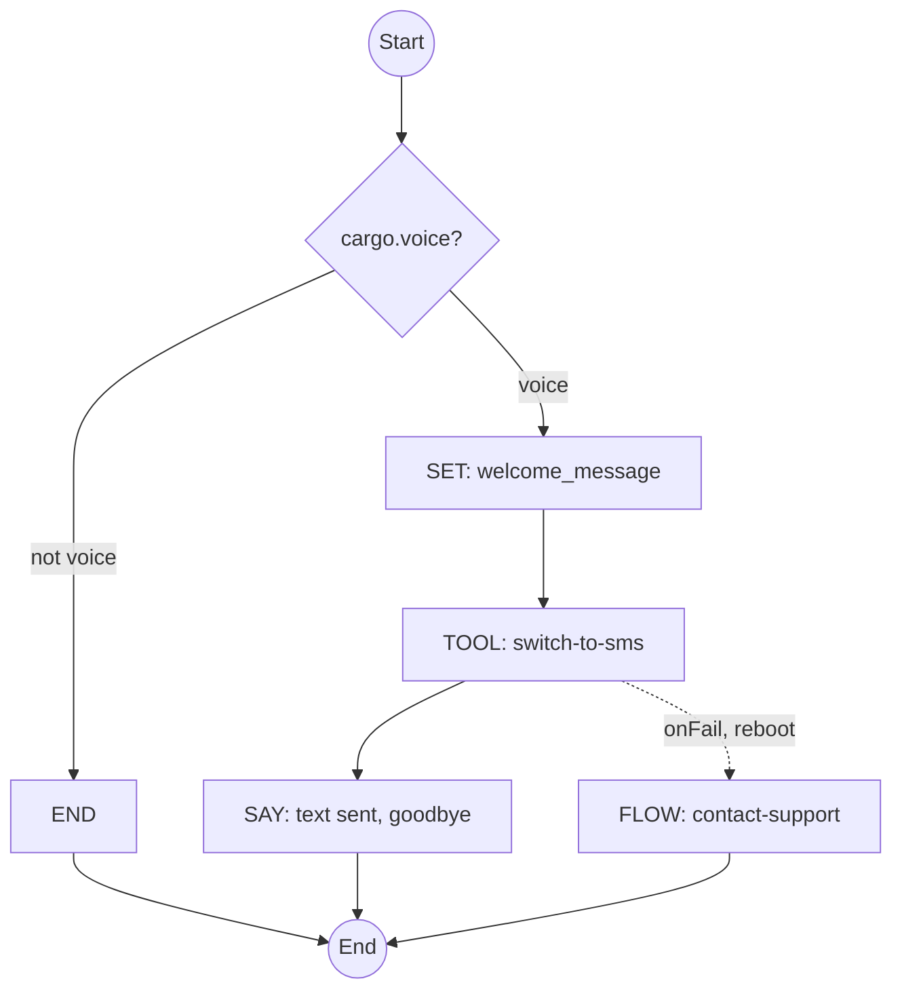

---

## AuthenticateUser
**ID**: `authenticate-user` · **Version**: 1.0.0 · **Sub-flow**  
**Description**: Generic flow to authenticate user via OTP sent to cell or email.

The gatekeeper. It collects a phone or email (via `get-cell-or-email`), optionally lets a tenant-supplied validator flow approve the contact, sends an OTP by SMS or email, and hands off to `get-and-validate-otp-code`. On success it sets `auth_result = true` and returns to its caller, with `cargo.otpVerified` set by the `validate-otp` tool.

### Parameters
*   `retry_flow` (string): Flow to reboot if the user wants to retry. The description says "default: authenticate-user", but **no step applies that default**. The value is forwarded as-is, so callers should pass it.
*   `cancel_flow` (string): Flow to reboot if the user cancels. The description says "default: cancel-process", but no step here applies it. `generic-retry-with-options` falls back to `contact-support`, and `get-cell-or-email` has no fallback.
*   `cell_number` (string): Phone already supplied by the caller. Forwarded so `get-cell-or-email` skips the contact prompt.
*   `email` (string): Email already supplied by the caller. Forwarded the same way.
*   `email_validator` (string, optional flow name): When supplied, it is called with `{email}` before an email OTP is sent, and it MUST set `contact_valid = true` to allow the send. **Fail-closed.** The validator must end by completion, because a `RETURN` in it terminates all flows.
*   `cell_validator` (string, optional flow name): Same contract, called with `{cell_number}` before an SMS OTP.

### Variables
`cell_or_email`, `cell_number`, `email`, `contact_valid` (true when no validator applies), `unverified_contact` / `unverified_contact_es` (the rejected contact phrased for the retry message: "the number 555…" / "the email a@b.c").

### Steps
1. `check_already_verified` (CASE) — `cargo.otpVerified` → **END** (return to the caller at once). Otherwise continue.
2. `get_contact_info` (FLOW `get-cell-or-email`, `call`) — passes `retry_flow`, `cancel_flow`, `cell_number`, `email`. Sets `cell_number` or `email`, or leaves the flow stack via one of its own exits.
3. `init_contact_valid` (SET) — `contact_valid` = false when a validator applies to the collected contact (`cell_validator` with a `cell_number`, or `email_validator` with an `email`); true otherwise.
4. `validate_contact` (CASE) — runs `{{cell_validator}}` with `{cell_number}` or `{{email_validator}}` with `{email}` (`call`). The cell validator is checked first.
5. `describe_unverified_contact` / `_es` (SET) — builds the phrase used below.
6. `gate_otp_on_contact_valid` (CASE) — `!contact_valid` → FLOW `generic-retry-with-options` (`replace`) with "Sorry, I could not verify {{unverified_contact}}.", `retry_flow`, `cancel_flow`, and `capture_patterns` for `cell_number` (`[0-9\-\(\)\.\s]{10,}`, normalizer `[^0-9]`) and `email`.
7. `send_otp_based_on_contact` (CASE):
   - `cell_number` → CALL-TOOL [`send-sms-otp`](#send-sms-otp) `{accountSid: null, from: cargo.twilioNumber, to: cell_number, container: cargo, language}`. `onFail` → `retry-authenticate-generic` (`replace`, "Sorry, text message delivery failed.", `allow_otp_entry: false`).
   - `email` → CALL-TOOL [`send-email-otp`](#send-email-otp) `{to: email, container: cargo, language}`. `onFail` → `retry-authenticate-generic` (`replace`, "Sorry, email delivery failed.", `allow_otp_entry: false`).
   - default → `retry-authenticate-generic` (`replace`, "Sorry, there was an unexpected error.", `allow_otp_entry: false`).
8. `set_cell_number_to_cargo` / `set_email_to_cargo` (SET, side effect) — `cargo.otp_cell_number = cell_number || ''`, `cargo.otp_email = email || ''`.
9. `get_and_validate_otp_code` (FLOW `get-and-validate-otp-code`, `call`).
10. `check_validation_result` (CASE) — `cargo.otpVerified` → SET `auth_result = true`. Otherwise → `retry-authenticate-generic` (`replace`, "Sorry, the code you entered was invalid or expired.", `allow_otp_entry: true`).

### Ends
Success returns to the caller (by completion) with `auth_result = true` and `cargo.otpVerified` set. Already verified → `END`. Failures leave through `generic-retry-with-options` or `retry-authenticate-generic`, or through `get-cell-or-email`'s own exits (cancel, live agent, off-topic hand-off).

### Flowchart
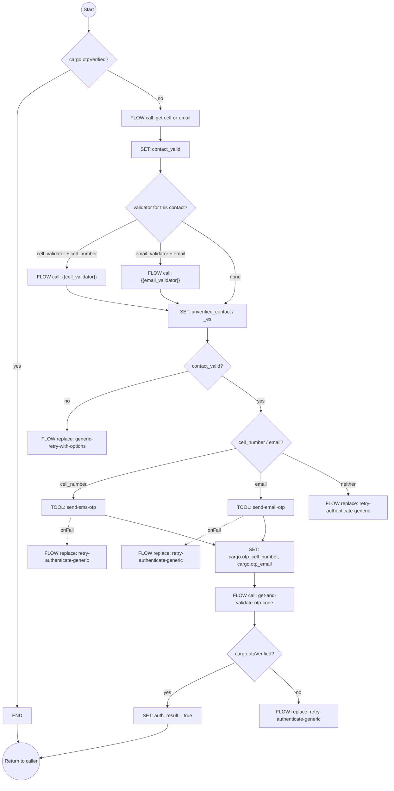

---

## GetCellOrEmail
**ID**: `get-cell-or-email` · **Version**: 1.0.0 · **Sub-flow**  
**Description**: Prompt user to provide either their cell phone number or email address for account lookup.

### Parameters
*   `retry_flow` (string): Flow to reboot if the user wants to retry.
*   `cancel_flow` (string): Flow to reboot if the user cancels.
*   Also reads `cell_number` / `email` when the caller passes them (`authenticate-user` does). These are not declared as parameters here.

### Steps
1. Guard `cell_number` and `email` to `''` when undefined.
2. `ask_cell_or_email_if_no_param` (CASE):
   - nothing supplied and `cargo.callerId` → SAY-GET `cell_or_email`: "To authenticate using your caller id, please {verb} yes. Otherwise … the phone or email associated with your account … To exit anytime … EXIT." `digits: {min 7, max 12, autoSubmitChars ["1"], autoSubmitMs 2500}` (a single keypad "1" auto-submits).
   - nothing supplied → SAY-GET `cell_or_email`: "Please {verb} [or enter] the phone or email associated with your account…", `digits: {min 7, max 12}`.
   - otherwise → `cell_or_email = cell_number || email` (no prompt).
3. Normalization (SET) — `prospective_cell_number` = digits only. `prospective_email` = the first email-shaped match, or failing that a match that allows spaces, with the spaces removed. `cell_or_email` is trimmed, lower-cased and stripped of punctuation.
4. `branch_on_cell_or_email` (CASE, first match wins):
   1. `validatePhone(prospective_cell_number)` → `cell_number` = those digits.
   2. `validateEmail(prospective_email)` → `email` = it.
   3. `cargo.callerId` and the answer is exactly one of `1, yes, please, sure, thanks, thank you, ok, okay, si, sí, por favor, gracias`, or `matchesChoice` phone words (`phone, cell, caller id, number, numero, teléfono, celular, identificador de llamadas`…) → `cell_number = cargo.callerId`.
   4. EXIT words (`abort, exit, quit, cancel, salir, cancelar`) in an answer of at most two words, or `*` → FLOW `{{cancel_flow}}` (`reboot`).
   5. live-agent words (`live, agent, manager, support, customer service, representative, human, operator, someone, real person, agente, persona, humano, operador(a), recepcionista`…) or `0` → FLOW `live-agent-requested` (`reboot`).
   6. `cargo.callerId` and digits that are not a valid phone → `cell_number = cargo.callerId`.
   7. digits that are not a valid phone (no caller ID) → FLOW `generic-retry-with-options` (`replace`): "Sorry, the phone number you provided isn't valid.", with `retry_flow`, `cancel_flow` and the cell/email `capture_patterns`.
   8. `cargo.callerId` (anything else) → `cell_number = cargo.callerId`.
   9. three or more words containing no digit and no `@` → **`RETURN ''`** with **`outcome: "unresolved"`, `reason: "auth_prompt_off_topic"`**. This terminates all flows and hands the turn to the host.
   10. default → FLOW `generic-retry-with-options` (`replace`): "Sorry, I do need the the phone or email associated with your account to proceed.", same parameters.

   Because branch 8 comes before branch 9, a caller with caller ID who says something off-topic is authenticated against the caller ID, not handed off.

### Ends
By completion (returning to `authenticate-user` with `cell_number` or `email` set), or through one of the exits above.

### Flowchart
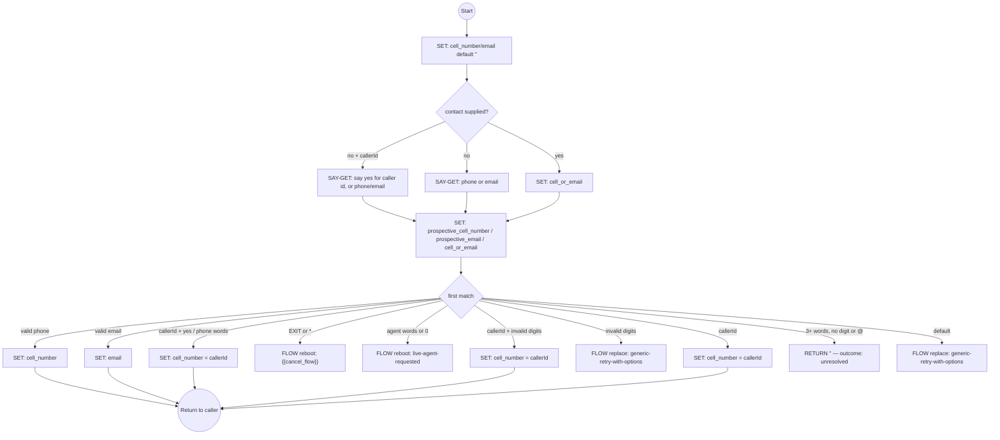

---

## GetAndValidateOtpCode
**ID**: `get-and-validate-otp-code` · **Version**: 1.0.0 · **Sub-flow**  
**Description**: Get and validate OTP code from user.

### Variables
`otp_code`, `normalized_otp_code`, `otp_destination`, `user_choice` (initial `""`).

### Steps
1. `set_otp_destination` — `cargo.otp_cell_number` if set, else `cargo.otp_email`.
2. `formatted_otp_destination` — "cell ending with 1, 2, 3, 4" (the last four digits, comma-separated) or "email: a@b.c". Spanish wording when `language == 'es'`.
3. `get_otp_from_user` (SAY-GET `otp_code`, `digits: {min 6, max 6}`) — "Please {verb} [or enter] the 6-digit verification code you received at {destination}. You can also [Press * or] {verb} EXIT to cancel."
4. `set_user_choice` — `user_choice` = the answer trimmed and lower-cased (for word matching).
5. `set_otp_code` — `normalized_otp_code` = digits only.
6. `proceed_to_validation` (FLOW `validate-otp-code`, `call`).

### Ends
By completion once `validate-otp-code` returns. Retries happen inside `validate-otp-code`, which replaces itself with this flow to prompt again.

### Flowchart
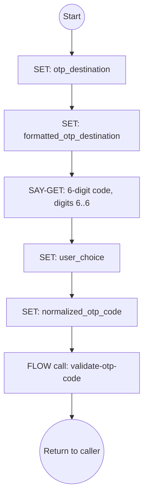

---

## ValidateOtpCode
**ID**: `validate-otp-code` · **Version**: 1.0.0 · **Sub-flow**  
**Description**: Validate OTP code entered by user — sets `cargo.otpVerified` on success.

Reads `normalized_otp_code` and `user_choice` from `get-and-validate-otp-code`. The flow has **no attempt limit**: a wrong or malformed code loops back to the prompt until the user exits, asks for an agent, or switches to text.

### Variables
`otp_validation_result` (boolean), `invite_text` (WhatsApp invite wording for this session's language; empty means the feature is off), `whatsapp_invite_sent` (true only if an invite was actually sent).

### Steps
1. `validate_otp_and_lookup` (CASE, first match wins):
   - `normalized_otp_code.length === 6` → CALL-TOOL [`validate-otp`](#validate-otp) `{otp: normalized_otp_code, container: cargo}` into `otp_validation_result`. `onFail` → FLOW `get-and-validate-otp-code` (`replace`).
   - EXIT words or `*` → FLOW `contact-support` (`reboot`).
   - live-agent words or `0` → FLOW `live-agent-requested` (`reboot`).
   - text words (`text, sms, message, text me, whatsapp, por texto, mensaje de texto, escríbeme`…) → FLOW `switch-to-text` (`reboot`).
   - "didn't receive / resend" phrases (English and Spanish) → SAY "The code was sent and may take longer to arrive. Take your time."
   - "I'm driving / busy / later" phrases → SAY "No problem. Say TEXT and I'll continue with you by message …, or {verb} the code whenever you are ready."
   - some digits, but not 6 → SAY "I was expecting a 6-digit code. Let's try again…"
   - default (no digits) → SAY "Let me explain. I sent you a message with a six-digit code in it. Read those six digits back to me. You can also {verb} AGENT … or EXIT …"
2. `retry_if_bad_format` (CASE) — not 6 digits → FLOW `get-and-validate-otp-code` (`replace`), which prompts again after the SAY above.
3. `check_validation_result` (CASE) — `cargo.otpVerified` → SET `otp_validated = true`; else SAY "That code didn't match. Let's try again."
4. `set_invite_text` — `global_whatsapp_invite_es` (Spanish) or `global_whatsapp_invite`, `''` when undefined.
5. `invite_if_wrong_code` (CASE) — not verified → CALL-TOOL [`send-whatsapp-invite`](#send-whatsapp-invite) `{accountSid: null, from: cargo.twilioNumber, to: cargo.otp_cell_number, inviteText, language, container: cargo}` into `whatsapp_invite_sent`. `onFail` → SET `whatsapp_invite_sent = false`. Per the tool's contract it returns `false` when `inviteText` is empty, when it already invited on this call, or when `to` is missing. `to` is `''` when the code went by email.
6. `mention_whatsapp_invite` (CASE) — `whatsapp_invite_sent` → SAY "I texted you a WhatsApp link so you can try again on WhatsApp to help overcome voice limitations."
7. `retry_if_wrong_code` (CASE) — not verified → FLOW `get-and-validate-otp-code` (`replace`).

### Ends
Verified → completion (the caller chain returns to `authenticate-user` or `retry-authenticate-generic`). Otherwise it loops, or leaves via the exits in step 1.

### Flowchart
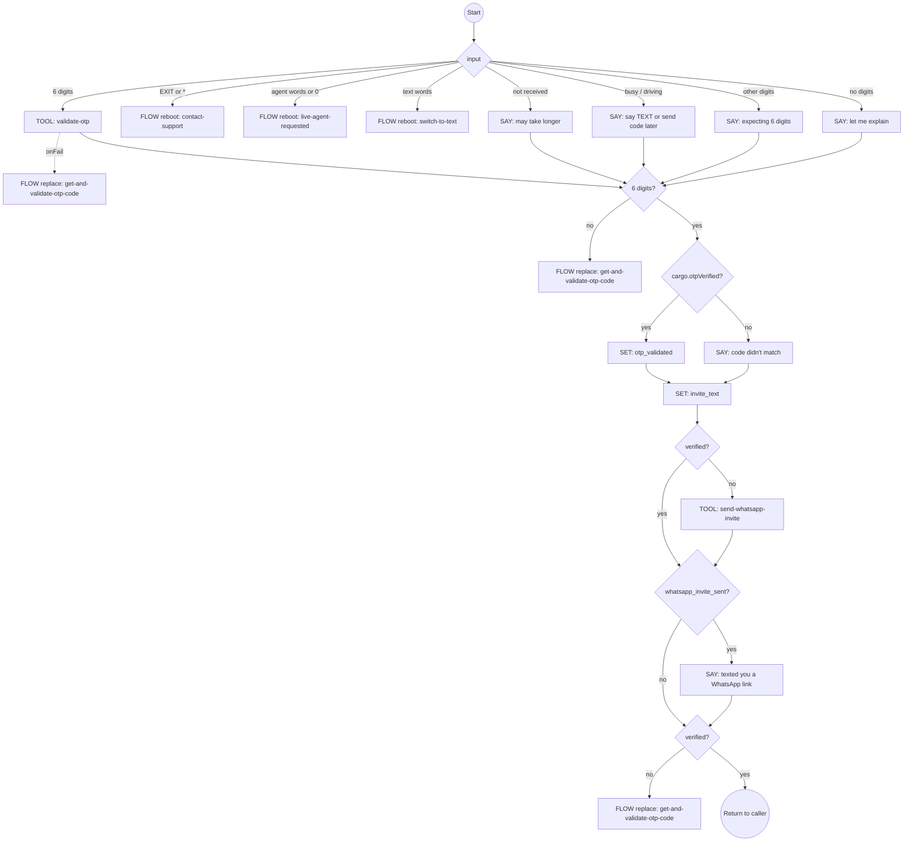

---

## GenericRetryWithOptions
**ID**: `generic-retry-with-options` · **Version**: 1.0.1 · **Sub-flow**  
**Description**: Generic flow to offer retry, switch to text, or contact support.

### Parameters
*   `error_message` (string): Error message to display.
*   `error_message_es` (string): Error message in Spanish.
*   `retry_flow` (string): Flow to reboot if the user wants to retry.
*   `cancel_flow` (string): Flow to reboot if the user cancels. Falls back to `contact-support` when empty.
*   `capture_patterns` (array): Optional `[{variable, regex, normalizer?}]` to capture from the user's answer. Most callers omit it; the SET step guards the reference, so absence means no smart capture rather than an evaluation failure.

### Steps
1. `say_error_and_prompt` (SAY-GET `user_choice`, `digits: {min 1, max 1}`) — "{error_message} Would you like to try again? To retry [Press 1 or] {verb} YES. [To switch to text press 9 or {verb} TEXT.] To abort [press the asterisk key or] {verb} EXIT." The bracketed keypad and TEXT options appear on voice only.
2. `check_smart_capture` — `smart_capture_result = normalizeAndFindCapture(user_choice, capture_patterns)` when patterns were passed, else `null`.
3. `handle_smart_capture` (CASE) — a capture → FLOW `{{retry_flow}}` (`reboot`) with parameters `{ [captured variable]: captured value, retry_flow, cancel_flow }`. So a user who answers the retry question with a corrected phone or email goes straight back in with that value.
4. `normalize_choice` — trim, lower-case, strip punctuation.
5. `handle_choice` (CASE):
   - yes words (`yes, sure, please, ok, okay, thanks, si, sí, seguro, por favor, gracias`) or contact words (`phone, email, cell, mobile, teléfono, celular, móvil, correo`…) or `1` → FLOW `{{retry_flow}}` (`reboot`).
   - `text` / `texto` or `9` → FLOW `switch-to-text` (`reboot`).
   - EXIT words or `*` → FLOW `{{cancel_flow || 'contact-support'}}` (`reboot`).
   - default → the same cancel target (`reboot`).

### Ends
Always by a `reboot` into another flow.

### Flowchart
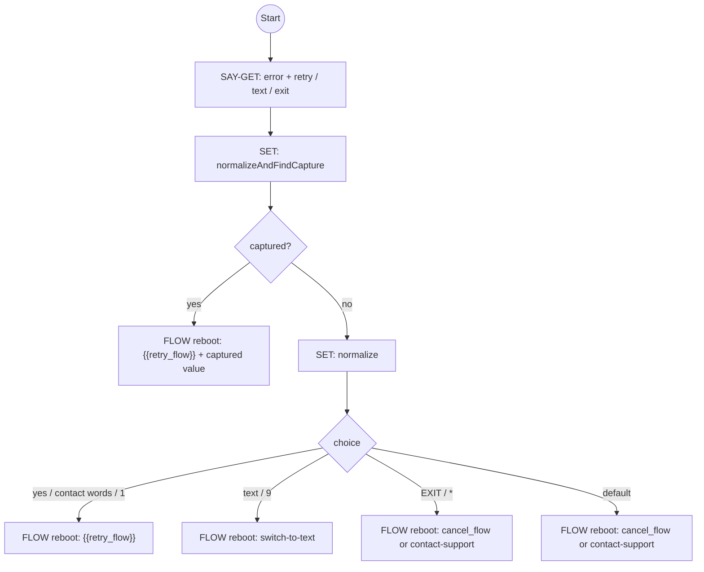

---

## RetryAuthenticateGeneric
**ID**: `retry-authenticate-generic` · **Version**: 1.0.0 · **Sub-flow**  
**Description**: Generic retry authentication flow.

Offers to retry authentication. It also accepts a 6-digit code typed straight into the retry prompt (when `allow_otp_entry`), or a new phone number or email.

### Variables / parameters
Declared as `variables` with defaults: `error_message` (default "Sorry, there was an unexpected error."), `error_message_es`, `allow_otp_entry` (declared default `"false"`), `user_choice`, `normalized_otp_code`. Every caller in the library reaches this flow with `callType: "replace"`, which does not apply declared defaults, and passes `error_message`, `error_message_es` and a boolean `allow_otp_entry` as parameters.

### Steps
1. `clear_cell` / `clear_email` — `cell_number = ''`, `email = ''`.
2. `retry_msg` (SAY-GET `user_choice`, `digits: {min 1, max 1}`) — "{error_message} Would you like to try again to get access to your account? To retry [Press 1 or] {verb} YES. [To switch to text press 9 or {verb} TEXT.] To abort … EXIT."
3. `normalize_user_choice` — trim, lower-case, strip punctuation.
4. `handle_choice` (CASE, first match wins):
   - `allow_otp_entry` and the answer has exactly 6 digits → SET `normalized_otp_code` (continues to step 5).
   - yes / phone / email words or `1` → FLOW `authenticate-user` (`replace`).
   - `text` / `texto` or `9` → FLOW `switch-to-text` (`reboot`).
   - EXIT words or `*` → FLOW `contact-support` (`reboot`).
   - live-agent words or `0` → FLOW `live-agent-requested` (`reboot`).
   - `validatePhone(digits)` → FLOW `authenticate-user` (`replace`) with `cell_number`.
   - `validateEmail(user_choice)` → FLOW `authenticate-user` (`replace`) with `email`.
   - default → FLOW `contact-support` (`reboot`).
5. `check_and_validate_otp` (CASE) — `normalized_otp_code` → FLOW `validate-otp-code` (`call`); else `contact-support` (`reboot`).
6. `check_validation_result` (CASE) — `cargo.otpVerified` → SET `auth_result = true`; else FLOW `retry-authenticate-generic` (`replace`), "Sorry, the code you entered was invalid or expired.", `allow_otp_entry: true`.

This flow does not receive `retry_flow` / `cancel_flow`. Its retry always restarts `authenticate-user` without them, and its cancel is always `contact-support`.

### Ends
Success by completion with `auth_result = true`. Otherwise by `replace` / `reboot` into another flow.

### Flowchart
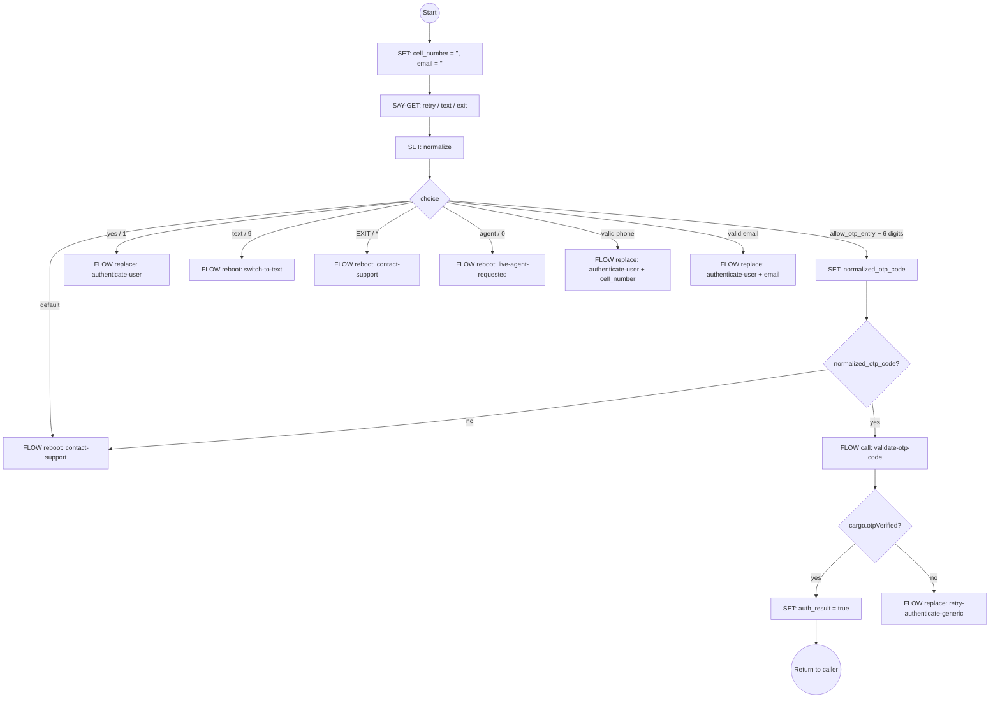

---

## LiveAgentRequested
**ID**: `live-agent-requested` · **Version**: 1.1.0 · **Sub-flow** (`primary: false`; prompt "live agent confirmation")  
**Description**: Interception flow when the user requests a live agent. It explains the AI's capabilities and offers to continue or transfer. When no agent is available, it speaks the optional `global_live_agents_comment` / `global_live_agents_comment_es` globals (e.g. agent hours) before the contact info.

### Variables
*   `user_choice` (string): continue with AI or transfer.

### Steps
1. `check_agent_available` (CASE) — `!cargo.agentPhoneNumber` → SAY "Our live agent team isn't available right now. [{global_live_agents_comment} ]Let me share our contact information so we can still help you."
2. `route_if_unavailable` (CASE) — `!cargo.agentPhoneNumber` → FLOW `contact-support` (`reboot`) with `closing_prompt: "What else can I assist you with?"` (and the Spanish counterpart). The SAY from step 1 is delivered together with ContactSupport's output.
3. `ask_user_choice` (SAY-GET `user_choice`, `digits: {min 1, max 1}`) — the deflection pitch ("Before I try to transfer you, I want you to know that I can help you faster with many inquiries…"), then "To have me help you now [Press 1 or] {verb} YES. For a live agent [Press 0 or] {verb} LIVE AGENT."
4. `normalize_choice` — trim, lower-case, strip punctuation.
5. `handle_choice` (CASE):
   - **anything that is not** a yes word (`yes, continue, sure, please, ok, okay, thanks, si, sí, seguro, por favor, gracias`) and not `1` → nested CASE: `cargo.agentPhoneNumber` → **`RETURN`** "Understood. Let me transfer you to a live agent." (Spanish: "Entendido. Te transfiero a un agente en vivo."). Otherwise → FLOW `contact-support` (`reboot`, same `closing_prompt`).
   - yes / `1` → SAY "Great! I'm glad to help. What would you like assistance with today?"

The flow only returns the transfer sentence. **Performing the transfer is the host's job**; no tool is called.

### Ends
`RETURN` (transfer), completion after the "Great!" SAY, or `reboot` into `contact-support`.

### Flowchart
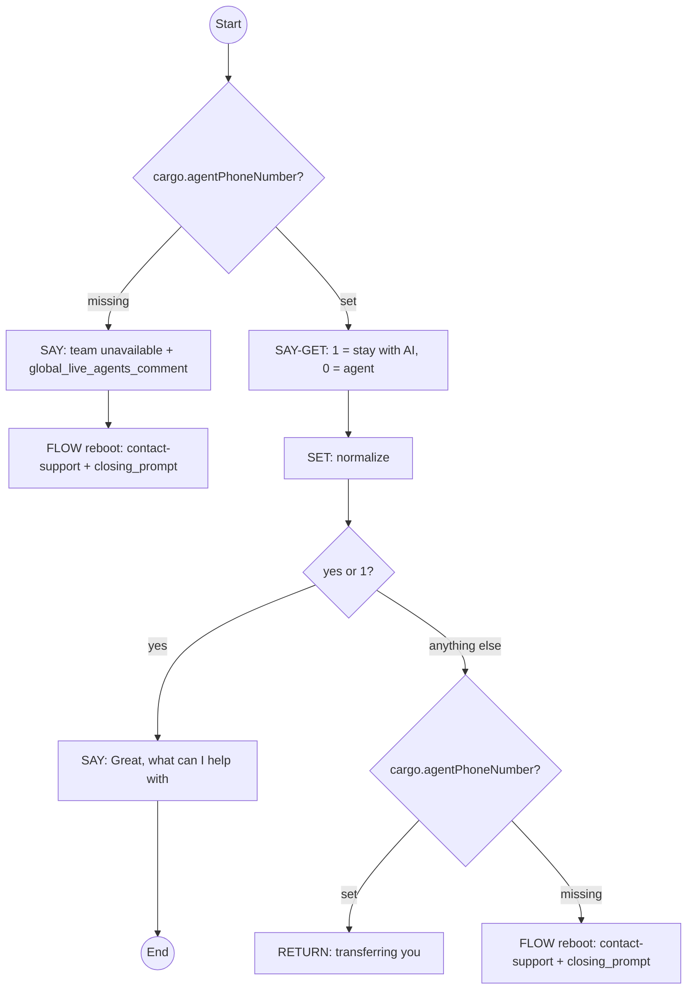

---

## Tools

All six are `local` tools. The host supplies the function named in `implementation.function` through `APPROVED_FUNCTIONS`. Their `parameters` use the flat form (a map of properties with no top-level `type`), so the engine calls the function with **positional arguments: the `required` names in order, then the remaining properties in definition order**. For these six tools that order matches the `implementation.args` list shown; the engine itself does not read `implementation.args`.

Each tool declares `returns`, a JSON Schema of the value the CALL-TOOL `variable` receives. It is documentation, plus an optional warning when the host sets `engine.validateToolReturns = true`. The summaries below paraphrase each `returns`.

`security.requiresAuth`, `auditLevel` and `dataClassification` are declarative. The engine enforces `security.rateLimit`.

### send-sms-otp
**Name**: Send SMS OTP — send an OTP code via SMS for authentication.  
**Implementation**: local `sendSMSOTP(accountSid, from, to, container, language)`, timeout 5000 ms. Rate limit: 5 per 300 s.

| Parameter | Type | Required | Notes |
|---|---|---|---|
| `accountSid` | string | yes | Twilio Account SID (the flows pass `null`) |
| `from` | string | yes | From phone number |
| `to` | string | yes | To phone number |
| `container` | object | yes | session cargo, where the OTP hash is stored |
| `language` | string | no | message language, e.g. `es`; omitted or unrecognised → English |

**Returns** a string: the lowercase hex SHA-256 (64 chars) of the 6-digit code, which is also written to `container.otpHash` along with `container.otpTimestamp`. The plaintext code is never returned. On the test-number path (`to` normalizes to `0000000000` or `+10000000000`) it is the hash of the fixed code `123456`. The flows do not store the result, and they detect failure through `onFail`.

### send-email-otp
**Name**: Send Email OTP — send an OTP code via email for authentication.  
**Implementation**: local `sendEmailOTP(to, container, language)`, timeout 5000 ms. Rate limit: 5 per 300 s.

| Parameter | Type | Required | Notes |
|---|---|---|---|
| `to` | string | yes | email address |
| `container` | object | yes | session cargo, where the OTP hash is stored |
| `language` | string | no | as above |

**Returns** `undefined` on every real send (the function has no return statement). Only for the test account (`test@instantaiguru.com`, case-insensitive) does it return the 64-char hex SHA-256 of the fixed code `123456`, also stored in `container.otpHash`. It never returns an object. Treat the result as absent; the flows do not store it.

### send-whatsapp-invite
**Name**: Send WhatsApp Invite — text the caller a wa.me link so they can finish authenticating on WhatsApp.  
**Implementation**: local `sendWhatsAppInvite(accountSid, from, to, inviteText, language, container)`, timeout 5000 ms. Rate limit: 5 per 300 s.

| Parameter | Type | Required | Notes |
|---|---|---|---|
| `accountSid` | string | yes | Twilio Account SID |
| `from` | string | yes | From phone number |
| `to` | string | yes | the caller's mobile that already received the OTP text |
| `inviteText` | string | no | wording from `global_whatsapp_invite` / `_es`. **Empty means the feature is off for this tenant**; there is no separate flag |
| `language` | string | no | session language |
| `container` | object | no | session cargo, used ONLY for the once-per-call latch `container.whatsappInvited` |

**Returns** a boolean. `true` only when the invite SMS was handed to Twilio. `false` on every skip and every error; the function never throws. It skips when: the latch `container.whatsappInvited` is already set; `inviteText` is empty or whitespace; `from` or `to` is missing; the tenant has no `config.wa-*` alias config, or that config has no usable `phone_number`. Any exception (e.g. a non-SMS line) also returns `false`.

### validate-otp
**Name**: Validate OTP — validate the OTP code entered by the user.  
**Implementation**: local `validateOTP(otp, container)`, timeout 5000 ms. Rate limit: 10 per 60 s.

| Parameter | Type | Required | Notes |
|---|---|---|---|
| `otp` | string | yes | the code |
| `container` | object | yes | session cargo holding `otpHash` / `otpTimestamp` |

**Returns** a boolean.
- `true` when `sha256(otp)` equals `container.otpHash` and the code is at most 10 minutes old. It then clears `otpHash` / `otpTimestamp` and sets `container.otpVerified = true` and `container.otpVerifiedAt`. **The flows read `cargo.otpVerified`, not the return value.**
- `false` when no code is stored.
- `false` when the code expired (the container is cleared and `otpVerified = false`).
- `false` on a hash mismatch (the container is left untouched, so the same code can be retried).

### switch-to-sms
**Name**: Switch to SMS — switch communication to SMS and send a confirmation message.  
**Implementation**: local `switchToSMS(accountSid, threadId, from, to, message)`, timeout 10000 ms. Rate limit: 10 per 60 s.

| Parameter | Type | Required | Notes |
|---|---|---|---|
| `accountSid` | string | yes | Twilio Account SID |
| `threadId` | string | yes | the thread to switch (the flow passes `{{sessionId}}`) |
| `from` | string | yes | From phone number |
| `to` | string | yes | To phone number |
| `message` | string | yes | SMS text |

**Returns** always the literal `true`. The chat context is re-saved under `<toNumber>-<dbPrefix>` with a fresh engine session carrying the old cargo, and the SMS is sent. Every failure (loading or saving the context, initializing the session, sending the SMS) is thrown, so `onFail` runs.

### send-twilio-sms
**Name**: Send Twilio SMS — send an SMS via Twilio. No flow in this library calls it.  
**Implementation**: local `sendTwilioSMS(accountSid, from, to, message, messageSid)`, timeout 10000 ms. Rate limit: 10 per 60 s.

| Parameter | Type | Required | Notes |
|---|---|---|---|
| `accountSid` | string | yes | Twilio Account SID |
| `from` | string | yes | From phone number |
| `to` | string | yes | To phone number |
| `message` | string | yes | SMS text |
| `messageSid` | string | no | optional message SID for tracking (default `""`) |

**Returns** a string: the Twilio Message `status` of the **last** part sent (a long message is split and the parts are sent in sequence). The value comes from Twilio, typically `queued`, or `accepted` via a Messaging Service. Failure: throws.
